# GUIスタイル現状調査(項目H-0)+ コンポーネント磨き込みBefore/After(項目H-2)

トラック2(GUIモダン化、フェーズH)着手にあたっての現状調査(H-0、事実の記録)と、
H-2「コンポーネント単位の磨き込み」で実施した変更ごとのBefore/Afterスクリーン
ショット記録をまとめたドキュメント。H-1〜H-5はH-0の調査結果を土台に進める。

## 1. QSS/パレットの実装場所

**別ファイルの`.qss`は存在しない。** 全て`gui/theme.py`(1ファイル、749行)に
Pythonコードとして実装されている。

- `_LIGHT_TOKENS` / `_DARK_TOKENS`(モジュール非公開の辞書): `bg`/`surface`/
  `surface_2`/`border`/`border_strong`/`text_primary`/`text_secondary`/
  `text_muted`/`accent`/`accent_soft`/`accent_text`の11キーを持つ、ニュートラル
  グレー+ティール系アクセントの配色トークン。**H-1が要求する「一箇所の辞書」は
  実質的に既に存在している**(公開名への変更・別ファイルへの切り出しの余地はあるが、
  ゼロから作る必要はない)。
- `_FLAT_QSS_TEMPLATE`: 上記トークンを`{token_name}`プレースホルダとして埋め込んだ、
  Python `str.format(**tokens)`方式のQSS文字列(H-1の完了条件で言及されている
  `.qss.tpl`ファイル+プレースホルダ置換という設計は、ファイルこそ分かれていないが
  仕組みとしては既に採用済み)。メニューバー・ツールバー・ドック・グループボックス・
  入力欄・リスト/ツリー/テーブル・タブ・スクロールバー等、主要なQt標準ウィジェットを
  一通りカバーしている。
- `_build_dark_palette()`: `QPalette`ベースの色(`Window`/`Base`/`Text`/`Button`/
  `Highlight`等)を個別に構築。QSSではカバーしきれない、ネイティブ描画に近い部分
  (選択ハイライト等)を担当。
- `_FlatThemeProxyStyle(QProxyStyle)`: QSSだけでは実現できない(むしろ壊れる)
  2箇所を自前描画で肩代わりする専用スタイル。詳細はコード内コメントに詳しいが、
  **Qtの既知の癖として明記されている**: `QCheckBox::indicator`や
  `QTabBar::close-button`に何か1つでもQSSプロパティ(padding/border-radius等)を
  指定すると、Qtがそのサブコントロールを「スタイルシートでカスタム描画される」
  ものとみなし、中身(チェックマーク/アイコン)を一切描画しなくなる。そのため
  チェックボックスの枠・塗り・チェックマーク、タブの閉じるボタンアイコンは
  QSSを一切使わず`drawPrimitive`/`standardIcon`/`standardPixmap`で直接描画している。
  **H-2以降でチェックボックスやタブに触れる際は、この制約を必ず踏襲すること。**
- `apply_theme(app, dark: bool)`: 上記3つ(パレット・QSS・ProxyStyle)を束ねる
  唯一の公開エントリポイント。スタイル自体は常に`Fusion`固定(ネイティブ⇔Fusion
  切り替えはしない。切り替えるとツールバーサイズ等がモードごとに変わってしまう
  ため、と明記されている)。

## 2. ダーク/ライト切り替えの仕組み

**QSS切り替えとパレット切り替えの併用。** `apply_theme()`が両方を同時に適用する。
切り替えの起点は`gui/mixins/ui_setup_mixin.py`の「表示」メニュー内
`dark_mode_action`(チェック可能なQAction)で、`gui/mixins/project_io_mixin.py`
経由でQSettingsの`dark_mode`キーに永続化される。

## 3. matplotlib側の配色とダークモードの連動

**トークンとは完全に独立した、個別のハードコード定数で連動している。**
`rcParams`経由ではなく、`Dataset`側のスタイル設定経由でもない。`gui/canvas.py`
(`MplCanvas`)は`self.dark_mode`という独自の真偽値属性を持ち(`main_window`から
都度設定される)、モジュール冒頭に以下の定数を個別に定義して、描画のたびに
`X if self.dark_mode else Y`という条件分岐で参照している:

```python
DARK_FIGURE_FACECOLOR = '#2b2b2b'   LIGHT_FIGURE_FACECOLOR = '#ffffff'
DARK_AXES_FACECOLOR   = '#1e1e1e'   LIGHT_AXES_FACECOLOR   = '#ffffff'
DARK_TEXT_COLOR       = '#e0e0e0'   LIGHT_TEXT_COLOR       = '#000000'
DARK_LEGEND_FACECOLOR = '#2A2A2A'   LIGHT_LEGEND_FACECOLOR = '#FFFFFF'
DARK_LEGEND_EDGECOLOR = '#4A4A4A'   LIGHT_LEGEND_EDGECOLOR = '#CCCCCC'
```

`gui/theme.py`の`_DARK_TOKENS["bg"]`(`#14171A`)等とは値が一致しておらず、
参照関係も無い。**Qt側のテーマとmatplotlib側の配色は、今のところ「別々に
存在する2つのダークモード実装」である。**

### 重複その2: `gui/minimap_widget.py`

ミニマップ(項目#83)は上記と全く同じパターン(`self.dark_mode`属性 +
`DARK_*`/`LIGHT_*`モジュール定数 + 条件分岐)を、`gui/canvas.py`とは別の値で
**独立に**再実装している:

```python
DARK_FIGURE_FACECOLOR = '#2b2b2b'   LIGHT_FIGURE_FACECOLOR = '#ffffff'
DARK_AXES_FACECOLOR   = '#1e1e1e'   LIGHT_AXES_FACECOLOR   = '#f2f2f2'
DARK_LINE_COLOR       = '#8ab4f8'   LIGHT_LINE_COLOR       = '#1a73e8'
DARK_SPAN_COLOR       = '#8ab4f8'   LIGHT_SPAN_COLOR       = '#1a73e8'
```

`gui/`配下を`DARK_*`/`LIGHT_*`命名パターンで横断検索した結果、この2ファイル
(`canvas.py`・`minimap_widget.py`)以外にこのパターンの重複は無いことを確認済み。

### `ExportPreviewPanel`は独自定数を持たない

`gui/export_preview_panel.py`はエクスポート用の一時`MplCanvas`を生成する際に
`temp_canvas.dark_mode = mw.canvas.dark_mode`とメイン画面の状態をそのまま
コピーしているだけで、独自の配色定数は持たない(プレビュー画像は常に
現在のアプリのモードに追従する。透過背景オプションは保存/コピー時のみ適用され、
画面プレビュー自体は常に不透明)。

## 4. カスタムウィジェット一覧

| ウィジェット | ファイル | スタイリング方式 | ダークモード対応 |
|---|---|---|---|
| ドック各種(プロパティ/エクスポートプレビュー/プラグインパネル) | `gui/main_window.py` | `gui/theme.py`のQSS(`QDockWidget::title`等)に一任 | Qt側のみ(theme.py経由)、個別対応なし |
| クイックアクセスツールバー(#87) | `gui/mixins/quick_access_mixin.py` | `QToolBar`+既存メニューの`QAction`を再利用するのみ。インラインスタイル・独自色は皆無 | 個別対応なし(theme.py経由のみ) |
| 色ピッカー(`ColorPickerWidget`) | `gui/color_picker_widget.py` | スウォッチボタンに**インラインの`setStyleSheet()`**を使用: `background-color: {現在の色}; border: 1px solid rgba(128,128,128,110); border-radius: 4px;`。この`rgba(128,128,128,110)`という枠線色は`gui/theme.py`のトークンから来ておらず、個別にハードコードされている | 枠線色は固定(グレー半透明)でモード非依存。スウォッチの背景色自体はユーザーが選んだデータ色なのでモードとは無関係 |
| レイアウトエディタのドラッグハンドル(#85) | `gui/mixins/layout_edit_mixin.py` | **Qtウィジェットではなくmatplotlibイベント駆動**。`canvas.mpl_connect('button_press_event'等)`で拾ったマウス座標を`ax.bbox`と直接比較するヒットテストのみで、専用の描画コード・可視インジケータは存在しない(選択中の判定はスピンボックス側UIの同期のみで表現)。QtのQSSともmatplotlibの配色定数とも無関係な第三のカテゴリ | 該当なし(視覚要素そのものが無い) |
| ミニマップ(#83) | `gui/minimap_widget.py` | 独自の`DARK_*`/`LIGHT_*`定数(上記3節参照) | あり(ただしcanvas.pyと重複・不整合) |
| エクスポートプレビューパネル | `gui/export_preview_panel.py` | `gui/theme.py`の`apply_form_spacing()`を呼ぶのみ。独自スタイルなし | メインキャンバスの`dark_mode`をそのままコピー(3節参照) |
| コマンドパレット(#47、`CommandPaletteDialog`) | `gui/dialogs.py` | `QLineEdit`+`QListWidget`のみ、インラインスタイルなし。チェック可能項目は`✓`をテキストに直接埋め込み(アイコン/QCheckBoxは不使用) | 個別対応なし(theme.py経由のみ)。`QuickAccessManagerDialog`も同一パターン |

## 5. アイコンの配色(`gui/icon_utils.py`)

Tabler IconsのSVG(`stroke="currentColor"`)を`color`引数で塗り替えて`QIcon`化する
仕組み(`icon(name, color=DEFAULT_ICON_COLOR, size=16)`)。`DEFAULT_ICON_COLOR =
"#3B3F42"`という**固定のダークグレー**が既定値で、呼び出し側の多くはこの既定値を
そのまま使っている。**ダークモード時にこの固定色がどう見えるかは今回未検証**
(暗い背景に暗いグレーのアイコンではコントラストが低くなる可能性がある。
H-2/H-3でアイコンに触れる際に併せて確認する価値がある、という所見のみ記録)。

## 6.「カスタムカラーパレット」機能との関係整理

ロードマップH-1の完了条件に「既存のカスタムカラーパレット機能(QSettingsに
永続化)との関係を整理する」とあるが、**調査の結果、これはUIテーマのアクセント
カラーとは無関係の別機能である**ことを確認した:

- `ColorPaletteDialog`(`gui/dialogs.py`)・`COLOR_PALETTES_SETTINGS_KEY`
  (`gui/mixins/dataset_mixin.py`)は、「自動配色」ボタンで使う**データセットの
  線色サイクル**(matplotlibのcolor cycleに相当)をユーザーが複数定義・切り替え
  られる機能であり、アプリのUIクロム(メニューバー・ボタン等)の配色とは
  無関係。
- `gui/color_history.py`は色ピッカーの「最近使った色」履歴(QSettings保存)で、
  これもUIテーマとは無関係。
- **アプリのUIテーマのアクセントカラー(`gui/theme.py`の`accent`/`accent_soft`/
  `accent_text`)をユーザーがカスタマイズできる機能は現状存在しない**
  (ハードコードされた固定値のみ)。

したがって、H-1で`tokens["color.primary"]`をユーザー設定で上書きできるように
という完了条件の一文は、**現状は上書き元となる既存のユーザー設定が無い**ため、
「今は考慮不要、必要になれば新規に設計する」という結論になる。上記2つの既存の
QSettings機能と衝突・混同しないよう、命名(トークンのキー名など)だけ注意すれば
十分。

## 7. H-1以降への申し送り事項

1. `_LIGHT_TOKENS`/`_DARK_TOKENS`は既にある。H-1は「ゼロから作る」のではなく
   「公開API化する/必要なキーを追加する/`gui/canvas.py`・
   `gui/minimap_widget.py`の重複した独自定数をこのトークン経由に一本化する」
   というリファクタが実体になる。
2. `gui/canvas.py`と`gui/minimap_widget.py`のダーク/ライト配色定数は、値が
   微妙に異なる(例: axes facecolor、`#1e1e1e`/`#ffffff` vs `#1e1e1e`/`#f2f2f2`)
   独立した重複。統合する際は「意図的な差」なのか「単なる書き忘れによるズレ」
   なのか切り分けが必要(今回は現状記録のみで判断しない)。
3. `_FlatThemeProxyStyle`のチェックボックス/タブ閉じるボタンの自前描画は、
   Qtの実機検証済みの制約に基づく必須の回避策。トークンをリファクタする際も
   この2箇所はQSSに戻さないこと。
4. `ColorPickerWidget`のスウォッチ枠線色のような、個別ウィジェットに埋め込まれた
   インラインの`setStyleSheet()`が他にも存在する可能性がある(今回はH-0の
   スコープで确認した範囲のみ記録。H-2のコンポーネント単位の磨き込みで
   横断的に洗い出す余地がある)。
5. アイコンの固定色(`DEFAULT_ICON_COLOR`)がダークモードでどう見えるかは
   要確認(上記5節)。

---

## H-2-1. メインツールバー・メニューバー

**変更内容**: `gui/mixins/quick_access_mixin.py`の`_create_quick_access_toolbar()`で
`toolbar.setMovable(False)`を追加。

**理由**: Qt標準の`QToolBar`は既定でユーザーがドラッグして再配置・フローティング化
できる「移動グリップ」(ツールバー左端のドット状のハンドル)を描画する。この
アプリでは上部に固定された単一のツールバーのみを想定しており(#87 クイックアクセス
ツールバー)、ユーザーが動かす機能は提供していないため、このグリップは
「動かせそうに見えるが実際には特別な意味を持たない」不要な視覚要素になっていた。
QSSではこのグリップ自体を隠すことはできない(Qt標準の`QStyle`描画の一部)ため、
`setMovable(False)`でQtの標準機能として無効化した(移動不可にすればグリップも
描画されなくなる)。フラット/ミニマルテーマの一貫性を高める、H-0の調査後に
実際にスクリーンショットを見て気づいた具体的な改善点。

**Before/After**(ライトモード):

| Before | After |
|---|---|
| 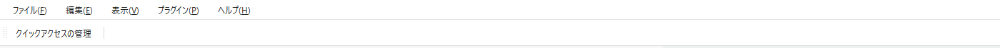 | 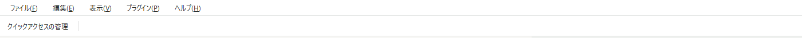 |

**Before/After**(ダークモード):

| Before | After |
|---|---|
| 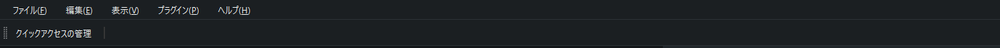 | 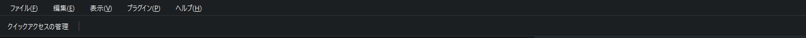 |

ツールバー左端の「::::」状のドラッグハンドルが消え、テキストがそのまま左端から
始まるようになった。メニューバー自体(ファイル/編集/表示/プラグイン/ヘルプ)は
H-1時点で既に`gui/theme.py`のQSS(`QMenuBar`/`QMenu`セクション)でカバー済み
であり、今回追加の変更は無し(H-0調査の通り、丸角・ホバー時のアクセント色強調
などは既に実装されていたため)。

**メニューの開閉状態(参考)**: メニューを開いた際の見た目(`QMenu`のドロップダウン、
ホバー時のアクセント色強調)は既存のQSSで実装済みで、今回変更していない
(角丸8px・ボーダー・ホバー時`accent_soft`背景、`docs/gui_style_audit.md` 1節参照)。

**テスト**: `tests/test_quick_access_mixin.py::test_quick_access_toolbar_is_not_movable`
を追加。既存のUIテスト(オフスクリーン)は全てグリーン。

## H-2-2. データセットリスト・データテーブル

**変更内容**: `gui/theme.py`(選択ハイライトの配色・枠線)と
`gui/main_window.py`(専用アイテムデリゲート・検索ボックスの間隔)の両方に渡る。

1. **選択ハイライトの配色**: `LIGHT_TOKENS`/`DARK_TOKENS`に`selection_highlight`
   トークンを新設(ライト: `rgba(37, 99, 235, 0.12)`、ダーク:
   `rgba(59, 130, 246, 0.22)`)。従来の「はっきりしたアクセント色(ティール系)の
   塗りつぶし」から、透明度を持たせた薄い青に変更した。
2. **選択ハイライトの形状**: `_DatasetTreeSelectionDelegate`
   (`gui/main_window.py`)を新設し、`dataset_list_widget`の`setItemDelegate()`で
   登録。選択時の背景描画をこのデリゲートが自前で行い、アイコン列+テキスト列+
   分岐(展開矢印)用インデント列を含む行全体を、リスト自体の角丸(8px、
   `DATASET_LIST_ITEM_RADIUS`)と揃えた単一の角丸矩形として描画する。
3. **リスト・検索ボックスそれぞれの枠線**: `QTreeWidget#dataset_list_widget`と
   `QLineEdit#dataset_search_edit`(新設objectName)の両方に`border: none;`を
   追加し、灰色の枠線を消した。**リストと検索ボックスを1つの箱に統合するのが
   目的ではない**(実機フィードバックで明確に区別された)ため、両者の間の
   レイアウト間隔(`container_layout.setSpacing()`)はそのまま独立を保っており、
   むしろ実機フィードバックを受けて4px→6px(約1.5倍)に広げている。

**理由・経緯(実機フィードバックによる複数回の調整)**:

- 当初のQSS(`::item:selected { background; border-radius; }`)だけでは、
  選択ハイライトを「アイコン列+テキスト列にまたがる単一の角丸矩形」として
  描画できないことが実機検証で判明した。Qt(Fusionスタイル)は
  `CE_ItemViewItem`の描画時にデコレーション(アイコン)列とテキスト
  (display)列を別々の矩形として扱い、`background`/`border-radius`もそれぞれ
  独立に適用するため、2つの矩形の角丸がわずかにズレて隙間から地の色が
  透けて見えていた。`border-radius: 0`にすれば隙間自体は消えるが、今度は
  リスト自体の角丸(8px)と揃わなくなる。QSSの`show-decoration-selected`
  プロパティで1矩形に統合できないか試したが、PySide6の
  `QTreeView`/`QTreeWidget`にはこのプロパティに対応する公開APIが無く
  (`hasattr()`で確認済み)、QSS指定も実機で効果が無かった。
- 分岐(展開矢印)用インデント列は、`delegate.paint()`とは別の
  `QTreeView::drawBranches()`という独自の経路で描画されており、モデル側の
  実際の選択状態を見るため、汎用のリスト共通スタイル(`accent_soft`を使う
  `QTreeWidget::item:selected`規則)がそのまま滲み出てしまう。このリストに
  限って`background: transparent`で打ち消している。
- デリゲートが描く矩形は当初アイコン+テキスト部分(`opt.rect`)だけで、
  分岐用インデント列の分だけ左端に隙間が空いてしまっていた
  (「ここの隙間空いちゃうのは直せる?」という実機フィードバックで発覚)。
  インデント列は何も描画されない(上記の理由で`transparent`)ため、
  デリゲートの矩形の左端をビューポートの0まで伸ばして埋めても他の描画と
  衝突しないことを確認し、修正した。

**Before/After**(ライトモード):

| Before | After |
|---|---|
| 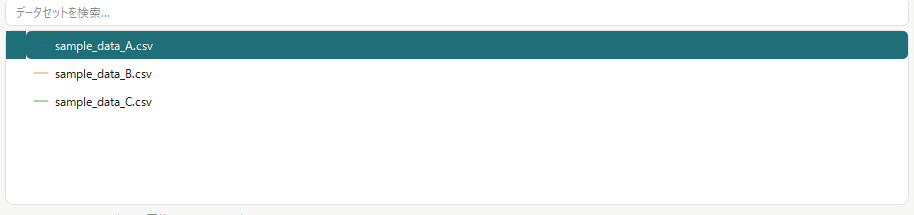 | 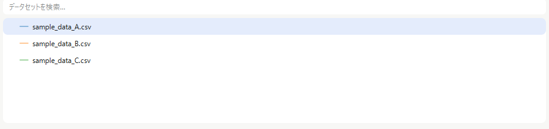 |

**Before/After**(ダークモード):

| Before | After |
|---|---|
| 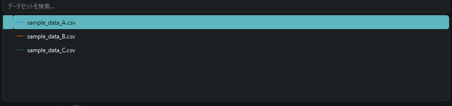 | 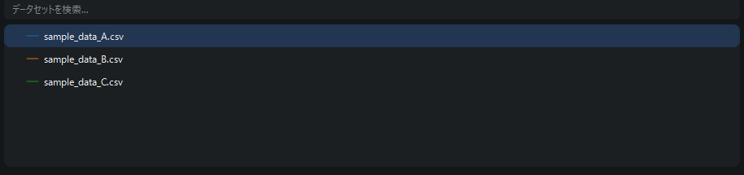 |

選択行が、濃いアクセント色の塗りつぶし(かつ左端に色の異なる箱が独立して
見えていた)から、リストの角丸と揃った単一の薄い青の帯に変わった。検索
ボックス・リストそれぞれの灰色の枠線も消え、間隔だけが独立した箱として
保たれている。

**テスト**: `tests/test_theme.py`に`selection_highlight`トークンの存在、
`current_selection_highlight_qcolor()`のrgba()パース、生成QSSの
`border: none`/`background: transparent`指定を検証するテストを追加。
`tests/test_main_window.py`に、デリゲートが実際に設定されていること・
検索ボックスのobjectName・間隔(6px)・デリゲートのpaint()が例外を出さない
ことを検証するテストを追加。

## H-2-3. ドック全般

**変更内容**: `gui/theme.py`(QDockWidgetの枠線・角丸・フォーカス時強調のQSS)
と、`gui/main_window.py`/`gui/main_app_window.py`(新設の
`theme.install_dock_focus_highlight()`呼び出し)の両方に渡る。

1. **境界線**: `QDockWidget { border: 1px solid {border}; border-radius: 8px; }`
   を追加。以前はタイトルバーの背景色だけが手がかりで、キャンバス周り
   (`plot_container`、1節参照)のような「1枚のカード」として認識しにくかった。
   `QDockWidget::title`にも上端の角丸(`border-top-left-radius`/
   `border-top-right-radius`)を追加し、ドック本体の角丸と揃えている。
2. **タイトルバー**: 既存のQSS(背景・パディング・太字)は変更なし。角丸の
   追加のみ。
3. **フォーカス時の強調**: QDockWidget自体には「アクティブ」を示すQt標準の
   状態が無いため、`theme.install_dock_focus_highlight(window)`を新設し、
   `QApplication.focusChanged`を監視してフォーカスされたウィジェットの祖先を
   たどりQDockWidgetを特定、動的プロパティ`dockActive`をQSSの属性セレクタ
   (`QDockWidget[dockActive="true"]`)経由で反映する。フォーカスが当たった
   ドックの枠線がアクセント色になる。プラグイン製パネル(項目D-1)も祖先を
   たどる方式のため個別登録なしで自動カバーされる。**複数タブ対応の注意点**:
   `focusChanged`はプロセス内全体で共有される単一のシグナルのため、
   見つかったドックが自分の管轄する`window`のものでない場合は無視する
   ガードが必須(各PlotterAppタブは完全に独立したウィンドウという設計方針、
   本ファイル冒頭の注意点参照)。`undo_history_dock`はPlotterApp(各タブ)
   ではなく`MainAppWindow`自身が持つドックのため、`gui/main_window.py`側の
   呼び出しとは別に`gui/main_app_window.py`側でも個別に組み込んでいる。

**Before/After**(ライトモード、上: 非フォーカス時、下: フォーカス時):

| Before | After(非フォーカス) | After(フォーカス) |
|---|---|---|
|  | 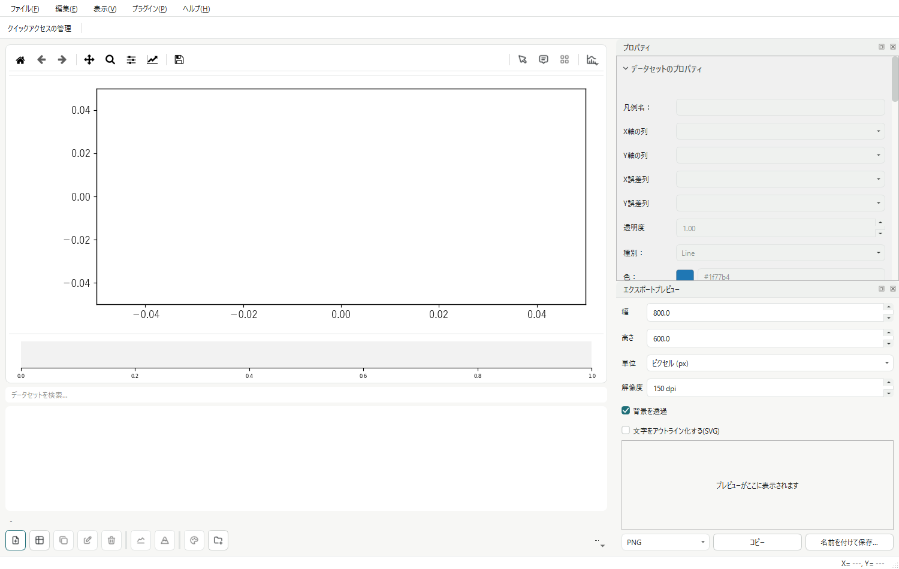 | 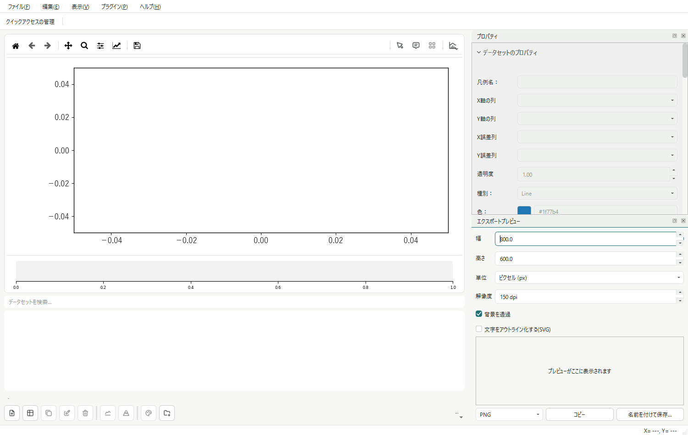 |

**Before/After**(ダークモード):

| Before | After(非フォーカス) | After(フォーカス) |
|---|---|---|
|  | 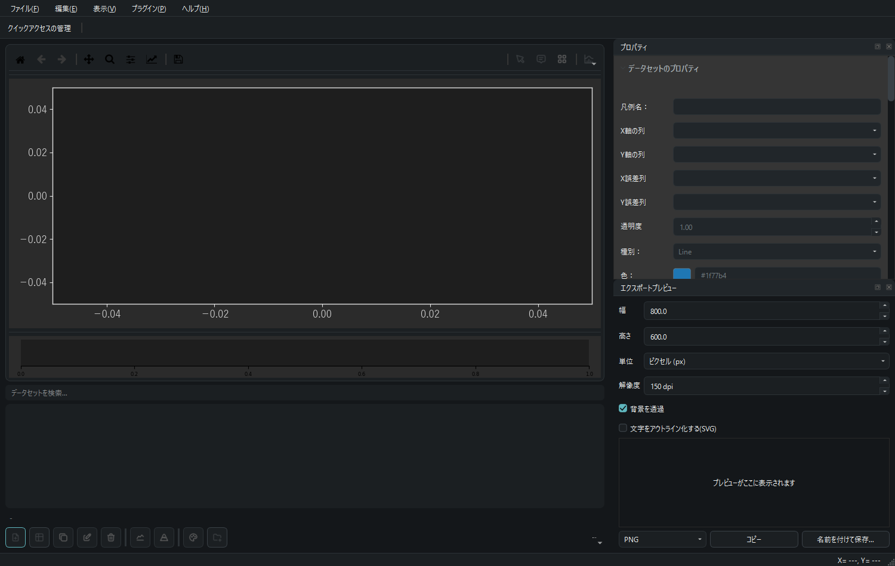 | 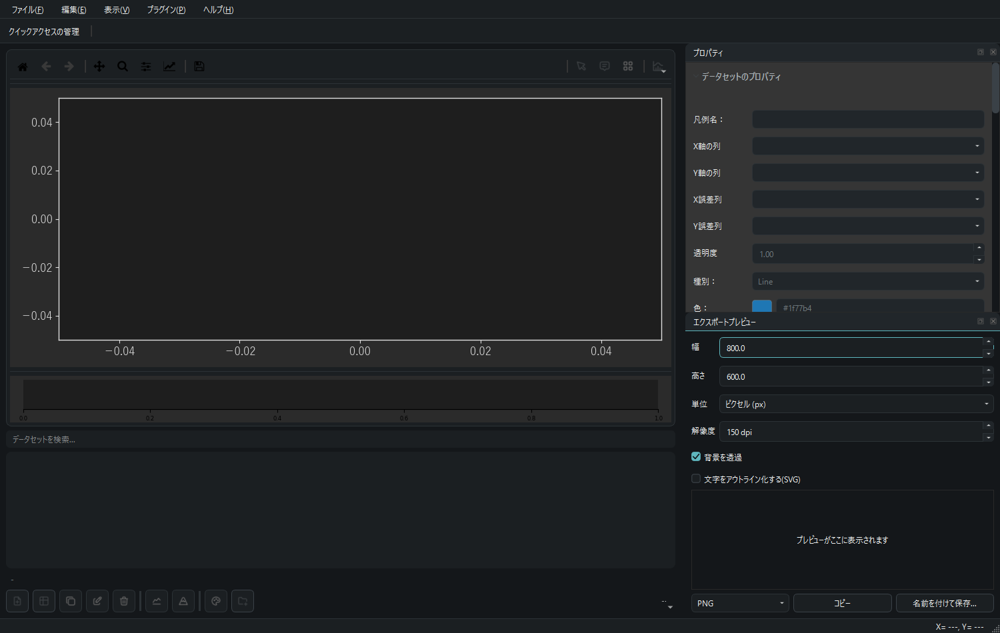 |

**テスト**: `tests/test_theme.py`に、生成QSSがQDockWidgetへ枠線・角丸・
`dockActive`属性セレクタを持つことを確認するテストと、
`TestDockFocusHighlight`クラス(フォーカス移動でdockActiveが立つ/外れる、
他ウィンドウのドックには影響しない、ウィンドウ破棄後にハンドラが
disconnectされる、の4パターン)を追加。`tests/test_main_window.py`・
`tests/test_main_app_window.py`にも、それぞれのウィンドウで実際に
`install_dock_focus_highlight()`が呼ばれていることを確認するテストを追加。

## H-2-4. ボタン・入力フィールド・コンボボックス

**変更内容**: 実機フィードバックによる複数回の調整。`gui/theme.py`
(スピンボックス/コンボボックスの矢印・選択色)と`gui/main_window.py`
(フォームラベルの末尾コロン除去)の両方に渡る。

1. **スピンボックスの上下ボタン**: 以前はフィールド右端に直接くっついた
   「外側の角だけ丸い」1つの帯だったが、参考イメージの提示を受け、上下
   それぞれが独立した小さな角丸ボックスに見えるよう全4隅を丸め、marginで
   枠線・フィールドの双方から少し離した。さらに「透明にして枠線も消して」
   との追加フィードバックを受け、ボタン自体の背景・枠線は常時透明にし、
   矢印アイコンだけが浮いて見えるミニマルな見た目に変更(hover/pressed時
   のみ背景色を出す)。
2. **矢印マークのサイズ**: 「もう少し大きく」とのフィードバックを受け、
   矢印画像の生成元(`_spinbox_arrow_icon_url()`)自体の三角形サイズを
   拡大(表示サイズだけを大きくしても、透明パディングの多い元画像を
   ただ引き伸ばすだけで見た目が小さいままだったため、キャンバスサイズ
   ごと見直した)。あわせて、キャッシュファイル名にサイズを含めるよう
   変更し(`spin_arrow_{direction}_{color}_{size}.png`)、寸法変更のたびに
   一時ディレクトリの旧サイズPNGを誤って使い回すことがないようにした。
   **回帰**: スピンボックス側のみ12pxに拡大し、コンボボックスの矢印が
   旧サイズ(10px)のまま揃っていなかった不具合が実機フィードバック
   (「コンボボックスとスピンボックスでマークの大きさそろってる?」)で
   発覚し、12pxに統一した。
3. **選択色をデータセットリストに揃える**: 「選択時とかポップアップとか
   色が緑だからデータセットリストの方に色合わせて」とのフィードバックを
   受け、テキスト選択(`QWidget`の`selection-background-color`)、
   メニュー/メニューバーの`::item:selected`、コンボボックスのポップアップ
   (`QComboBox QAbstractItemView`)、汎用のリスト/テーブルの
   `::item:selected`を、いずれもティール系の`accent`/`accent_soft`から、
   データセットリスト(H-2-2)で導入した薄い青の`selection_highlight`
   トークンに統一した。ボタンのhover/pressedやフォーカス枠など「選択」
   以外のアクセント表現は従来通り`accent`のまま変更していない。
4. **フォームラベルの末尾コロン除去**: 「各設定項目のあとの：はなくして」
   とのフィードバックを受けて対応。`ui_main_window.py`(Qt Designer/
   pyside6-uic生成物)の`retranslateUi()`には、多くのフォームラベルに
   全角コロン「：」(`：`のエスケープ形式で埋め込まれており、リテラル
   文字列としての単純なgrepでは見つからないので注意)が焼き込まれている。
   `.ui`ソースファイル自体がこのリポジトリに存在せず再生成もできないため、
   `PlotterApp.__init__`の最後(全てのラベル構築が終わった後)で
   `_strip_trailing_colon_from_labels()`を呼び、QLabelのtext()を
   走査して末尾の「：」だけを取り除く形で対応した(Designer側の元データは
   変更していない)。

**Before/After**(スピンボックス、ライトモード):

| Before | After |
|---|---|
| 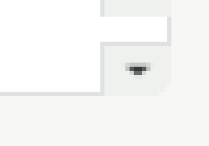 | 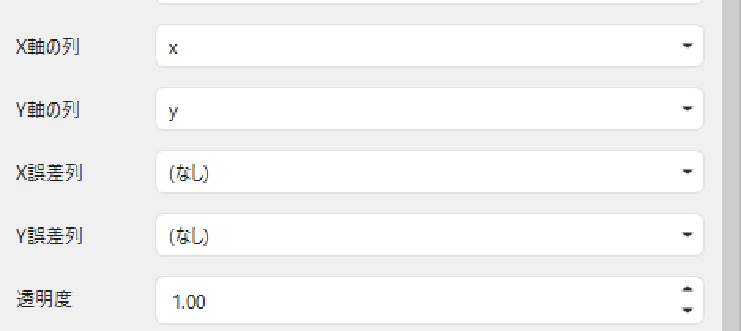 |

**After: コンボボックスのポップアップ選択色**:

| ライト | ダーク |
|---|---|
| 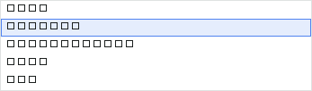 | 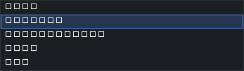 |

**After: フォームラベルのコロン除去**:

| ライト | ダーク |
|---|---|
| 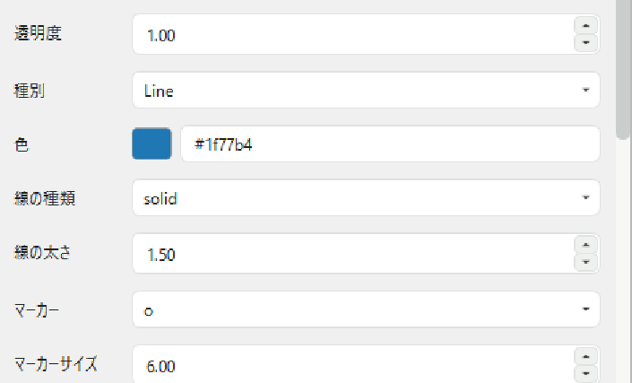 | 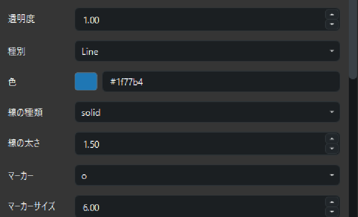 |

**テスト**: `tests/test_theme.py`に、選択系プロパティが軒並み
`selection_highlight`を使っていること・旧ティール色がもう使われていない
こと・コンボボックスとスピンボックスの矢印サイズが一致していることを
確認するテストを追加。`tests/test_main_window.py`に
`TestStripTrailingColonFromLabels`クラス(末尾コロンのみ除去・末尾以外の
コロンは残す・実際のPlotterAppのラベルで確認、の3パターン)を追加。

### H-2-4 追加分(同日、さらなる実機フィードバック)

一度H-2-4を完了とした後、実機でさらに気になった点を追加で反映した。

1. **フォーカス/選択/チェック状態の色をすべて青(selection_accent)に統一**:
   「プロパティウィンドウでスピンボックスとかをフォーカスしたときの色が緑の
   まま」「チェックボックスの塗りつぶしの色も」「タブの選択色(画像で提示)も」
   という指摘を受け、以下すべてをティール系`accent`/`accent_soft`から新設の
   `selection_accent`(opaqueな青、`selection_highlight`と同じ色相)に統一した:
   `QPushButton:focus`/`QToolButton:focus`の枠線、入力欄(`QLineEdit`等)の
   `:focus`枠線、`QDockWidget[dockActive="true"]`(H-2-3のフォーカス強調)の
   枠線、`QTabBar::tab:selected`の下線とテキスト色、`QRadioButton::indicator:
   checked`の塗りつぶし、チェックボックス(`_FlatThemeProxyStyle.
   _draw_checkbox_indicator`)のチェック時の塗りつぶし。ボタンの通常/hover/
   pressed/checked背景や`QPushButton:default`などの「ブランドアクセント」
   としてのティール系`accent`自体は変更していない(あくまで「選択・
   フォーカス・チェック」を示す用途だけを青に揃えた)。
2. **プロパティドックの余計な枠線を除去**: 「プロパティウィンドウの方に
   無駄に枠線がある」の正体は、`QScrollArea`自体にQSSで何もスタイルして
   いなかったため、Qt(Fusion)の既定の枠線(sunkenフレーム)がそのまま
   出ていたこと。プロパティドックの中身だけが`QScrollArea`でラップされて
   おり(`gui/main_window.py`の`merged_scroll_area`)、エクスポート
   プレビューはラップされていないため、両者の見た目が意図せず不揃いに
   なっていた。`QScrollArea { border: none; }`を追加して解消。
3. **背景色を寒色寄りのニュートラルグレーに変更**: 「背景色が若干黄色っぽい」
   との指摘を受け、`bg`/`surface_2`トークン(旧: `#F7F7F5`/`#EFF1EF`、共に
   G成分がわずかに高く暖色/黄み寄りだった)を、3案(ニュートラル/寒色寄り/
   濃いめ寒色)提示の上で選ばれた「寒色寄りグレー」(`bg=#F6F7F9`、
   `surface_2=#EEF0F3`)に変更した。
4. **タイトル/軸ラベルの編集をポップアップダイアログ化**: 「軸ラベル、
   タイトルは入力画面がポップアップウィンドウとして出てくるような形が
   いい」とレイアウト画像の提示を受け、以前はプロパティパネルの「Aa」
   ボタンから開くQMenu(太字/イタリック/上付き/下付きのアイコンボタン+
   ギリシャ文字/記号パレットをネストしたポップアップパネル)だった実装を、
   独立した`LabelEditDialog`(`gui/dialogs.py`)に置き換えた。テキスト入力欄
   + 装飾ボタン4種(常時見える横一列、データセット操作ボタン列と同じ
   `QPushButton[iconOnly="true"]`の正方形アイコン)+ Ω記号パレット(引き続き
   ポップオーバー)+ OK/Cancelという、提示されたレイアウト案の通りの構成。
   ギリシャ文字/記号パレット(`LABEL_SYMBOL_PALETTE`)も、「四則演算の記号とか
   プロットでよく使う数学記号があるといいかも」との追加要望を受けて、
   従来のギリシャ文字16種に加えて×÷±∓≈≠≤≥∞→←∂∇∫∝°の16種
   (算術・微積分・比例・度数記号)を追加し、計32種にした(`\sqrt{...}`の
   ような引数必須のマクロは単純な`$\macro$`挿入方式と相性が悪いため、
   引数不要なマクロのみを収録している。全マクロがmatplotlibのmathtext
   パーサーで実際に解釈できることをテストで確認済み)。

**Before/After**(タブ選択色):

| ライト | ダーク |
|---|---|
| 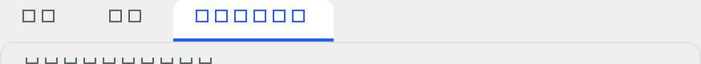 | 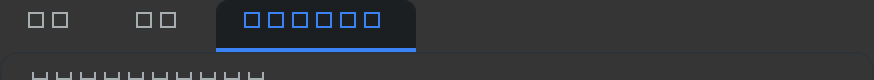 |

**After: フォーカス枠・ドックのフォーカス強調(いずれも青)**:

| 入力欄フォーカス | ドックのフォーカス強調 |
|---|---|
| 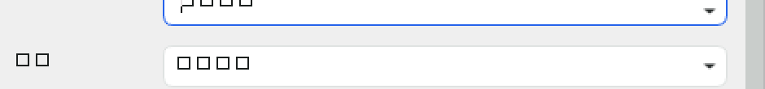 | 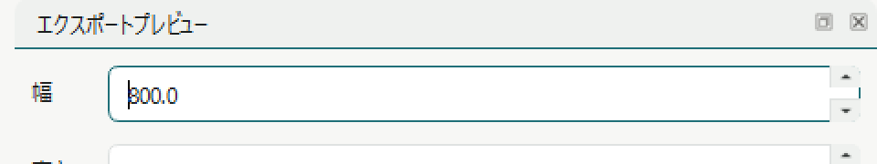 |

**Before/After**(プロパティドックの枠線・背景色、まとめて):

| Before(旧背景色+余計な枠線) | After(新背景色、枠線解消) |
|---|---|
|  | 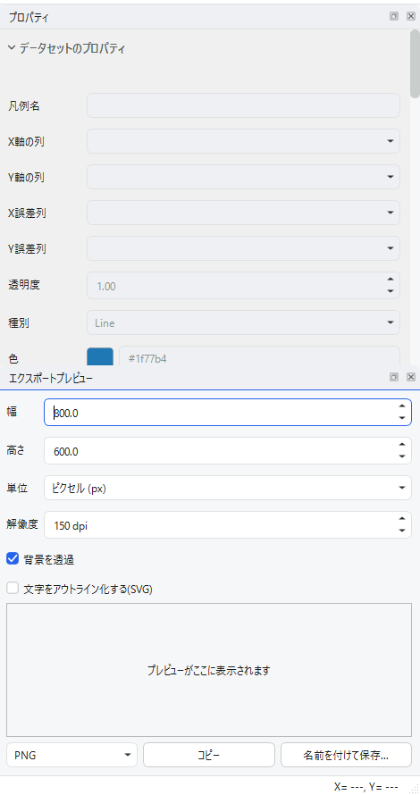 |

**After: タイトル/軸ラベルのポップアップ編集ダイアログ**:

| ライト | ダーク |
|---|---|
| 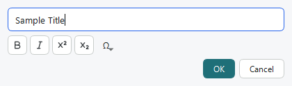 | 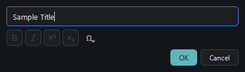 |

**テスト(追加分)**: `tests/test_theme.py`に、`selection_accent`トークンの
存在・opaqueであること、フォーカス枠線・ドックのフォーカス強調・タブ選択・
ラジオボタンのQSSが`selection_accent`(`#2563EB`)を使っていること、
チェックボックスの実際の描画ピクセル色が`selection_accent`と一致すること
を検証するテストを追加。`tests/test_main_window.py`に、
`_open_label_edit_dialog()`がOK/Cancelそれぞれで正しく振る舞うこと、
`LabelEditDialog`の記号挿入・装飾ラップ・未選択時の案内メッセージ、
パレットが32種で全マクロがmathtextとして解釈可能なことを検証するテストを
追加。`tests/test_dialogs.py`にも`LabelEditDialog`の初期値/手入力反映の
基本テストを追加。

### H-2-4 追加分(続き、同日さらに続いた実機フィードバック5件)

`LabelEditDialog`公開直後の実機確認で、さらに5件の指摘を受けて追加対応した。

1. **プロパティドックの背景色が反映されていなかった真因**: 上記の背景色
   トークン変更(`bg`/`surface_2`)後も「プロパティウィンドウの背景色が
   そのまま」という指摘が続いた。調査の結果、`QDockWidget`のQSSルールには
   `border`/`border-radius`(H-2-3)しかなく、`background`が一度も指定されて
   いなかったため、OSネイティブパレットの既定色がそのまま透けて見えていた
   ことが判明(H-2-3時点では気づかれなかった見落とし)。`background: {bg};`
   を追加して解消。
2. **`LabelEditDialog`の装飾ボタンで選択範囲が拾えないバグ**: 「文字選択して
   ハイライトされてからボタン押しても文字を選択してって出る」。原因は
   `QPushButton.clicked`がマウスの押下+離す操作の後、フォーカスが既に
   クリックされたボタン側へ移ってから発火するため、その時点で
   `text_edit.hasSelectedText()`が偽になっていたこと(本コードベースで
   過去にも複数回踏んでいる既知のバグクラス)。装飾4ボタン+Ωボタンの
   `pressed`シグナル(フォーカス移動前に発火)で選択範囲を先に捕捉する
   `_capture_pending_selection()`を導入し、`_apply_wrap`/`_insert_symbol`は
   捕捉済みの状態のみを参照するよう変更。
3. **タイトル/軸ラベル欄クリックでダイアログが開くように**: 従来は
   「Aa」ボタンを押した時だけダイアログが開いていたが、「画像のテキスト欄を
   クリックしたらポップアップが展開するように」との指摘を受け、入力欄自体の
   クリックでも開くよう変更。既存の`QLineEdit`(`title_text_edit`等)は
   `.textChanged`等の既存シグナル配線を壊さないため非表示のまま温存し、
   新規`_ClickableMathPreviewLabel`(`gui/main_window.py`)を可視/クリック
   可能な代替ウィジェットとして`QHBoxLayout`でラップ、`formLayout_3`に
   `replaceWidget`で差し込んだ。
4. **mathtextのライブプレビュー**: 「画像のテキストボックスではmathtextを
   翻訳した形式をプレビューしといて」との指摘を受け、上記プレビューラベルに
   実際の描画結果を表示する`gui/mathtext_preview.py`を新規作成
   (`matplotlib.figure.Figure`+`FigureCanvasAgg`で描画し、アルファ>0の
   範囲だけクロップ)。`textChanged`およびダイアログAccept時に再レンダリング。
   実装中、matplotlibの既定フォント(DejaVu Sans)が日本語グリフを持たず、
   プレースホルダ("タイトルを入力"等)や日本語タイトルがtofuボックスに
   なる不具合が発覚。`fig.text(..., family=["DejaVu Sans", "Yu Gothic",
   "Meiryo", "MS Gothic"])`のフォールバックリストで解消した。
   **既知の残課題**: このフォールバックはプレーンテキスト経路にのみ効き、
   `"$\alpha$ vs 時間"`のようにmathtext記法と日本語が同一文字列に混在する
   場合は、mathtextパーサがfamily指定を経由しない別のフォント解決経路
   (`mathtext.fontset` rcParam)を使うため、日本語側は依然tofuのままになる
   (`findfont()`自体は`.ttc`パスを正しく返すため、より内部のfreetype/
   mathtextエンジン側の制約と推測)。これは本プレビュー機能固有の問題では
   なく、実プロット本体(`gui/canvas.py`の`ax.set_title()`等、
   `axis_label_font`未設定時)も同じ制約を抱えるアプリ全体の既存の限界。
   `mathtext.fontset`はmatplotlibのグローバルrcParamsで、変更すると全プロット
   描画に影響するため、対応はスコープ外として見送った。
5. **ボタンhoverの色が緑のまま**: 「フォーカス時は青になっているのに、
   マウスを合わせたときの色が緑のまま」。`QPushButton:hover`の
   `border-color`だけ`{accent}`(ティール)のまま更新漏れになっていたのを
   `{selection_accent}`に統一して解消。

ダークモード切替時にプレビューラベルが旧配色のまま残らないよう、
`_on_toggle_dark_mode`(`gui/mixins/ui_setup_mixin.py`)から
`_refresh_all_label_previews()`を呼ぶよう追加。テーマトークンの汎用
アクセサ`theme.current_tokens()`を新設(`_current_tokens`の非公開状態に
Python側から安全にアクセスするため)。

**Before/After**(プロパティドック背景・クリックで開くプレビュー、まとめて):

| ライト | ダーク |
|---|---|
| 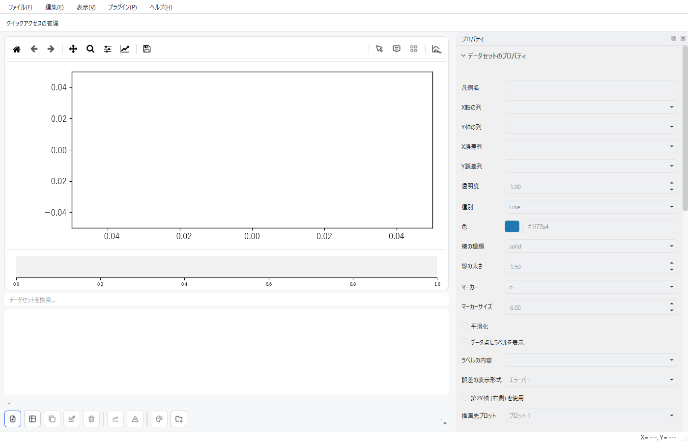 | 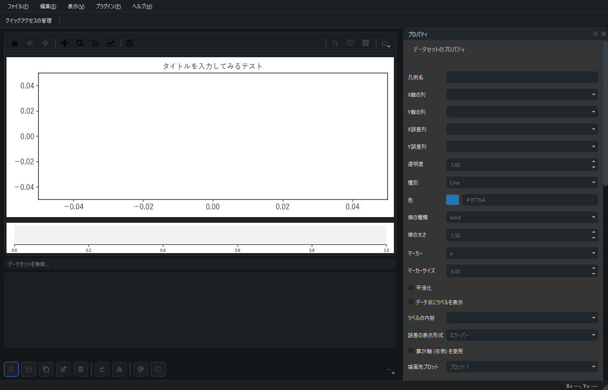 |

**After: クリックでダイアログが開く**:

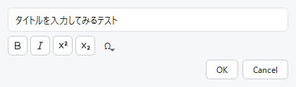

**After: 日本語mathtextライブプレビュー**:

| ライト | ダーク |
|---|---|
| 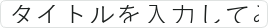 | 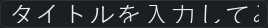 |

**After: ボタンhover色(青)**:


**テスト(追加分・続き)**: `tests/test_mathtext_preview.py`(新規)に、
`render_mathtext_to_pixmap()`がプレーンテキスト/空文字列/正常なmathtext/
壊れたmathtext構文それぞれで非空のQPixmapを返すこと、テキスト長に応じて
幅が変わること、日本語テキストでグリフ欠落警告が出ないことを検証する
テストを追加。`tests/test_theme.py`に、`QDockWidget`の`background`が
`bg`トークンを使うこと、`QPushButton:hover`の`border-color`が
`selection_accent`を使うこと、`current_tokens()`がテーマ切替に追従する
ことを検証するテストを追加。`tests/test_main_window.py`に、
プレビューウィジェットがタイトル/X軸/Y軸ラベルの3つ分登録されていること、
バッキングの`QLineEdit`が非表示でプレビューラベルが可視であること、
プレビューをクリックすると`LabelEditDialog`が開き結果が書き戻されること、
`textChanged`でプレビューのpixmapが更新されること、ダークモード切替で
`_refresh_all_label_previews()`が呼ばれること、`_ClickableMathPreviewLabel`
が左クリックで`clicked`シグナルを発火し`WA_Hover`属性を持つことを検証する
テストを追加。

### H-2-4 追加分(3回目、「直したはずが直っていなかった」2件の再修正)

前回の修正の直後、実機でさらに2件の指摘が届いた。いずれも「一度直したはずが
実際には直っていなかった」もので、原因調査の過程で当初の理解が誤っていた
ことが判明した。

1. **`LabelEditDialog`の装飾ボタン、選択範囲バグの再発**: 「選択してボタン
   押しても文字選択しろって出る」。前回はQPushButton.clickedがマウス押下
   →解放完了後に発火する「遅さ」が原因と考え、pressed(押下の瞬間)で選択
   範囲を先読みする対処をしたが、これは`.pressed.emit()`を手動で発火させる
   テストでしか検証しておらず、実際のマウスクリック(`QTest.mouseClick()`)
   で再現したところ直っていないことが判明した。真因を掘り下げた結果、
   「clickedが遅い」のではなく、**QPushButtonの既定フォーカスポリシー
   (StrongFocus)により、Qtがマウス押下イベントをボタン自身へ配送する前の
   段階でフォーカスをボタン側へ移してしまい、その時点でQLineEdit側の選択
   状態が既に失われている**ことが真因だった(この経路はボタン自身の
   pressed/clickedシグナルよりも早く走るため、pressedで捕捉しても手遅れ)。
   本質的な修正は、装飾ボタン(太字/イタリック/上付き/下付き/Ω/記号パレット
   各項目)すべてに`setFocusPolicy(Qt.NoFocus)`を設定し、そもそもフォーカスを
   渡さないようにすること。pressedでの先読みロジック自体は無害なので保険
   として残した。
2. **プロパティウィンドウの背景色、再度の不一致**: 「プロパティウィンドウの
   背景色が他と違う」。前回`QDockWidget`に`background: {bg}`を追加したが、
   実機ではまだ違って見えるとの指摘。`app.widgetAt()`でピクセル座標の実体を
   特定し`QWidget.grab()`で個別に検証したところ、犯人は`QDockWidget`でも
   `QScrollArea`のビューポート(直下の子)でもなく、その中に`setWidget()`で
   入れている中身のwidget(`QScrollArea`直下の"孫"、
   `gui/main_window.py`の`merged_properties_container`)だった。
   `app.setStyleSheet()`でアプリ全体にQSSを適用すると、Qtの既知の挙動として
   全`QWidget`が`WA_StyledBackground`扱いになり、明示的な`background`指定の
   無いプレーンな`QWidget`でも`QPalette`のWindowロール色(このアプリの
   ライトモードはOSネイティブパレットをそのまま使っているため実測
   `#F0F0F0`、狙いの`bg`トークン`#F6F7F9`とは肉眼でも判別しづらいほど近いが
   別の色)で不透明に塗りつぶされてしまい、`QDockWidget`側の`background`
   指定は完全に覆われて見えなくなっていた。`QScrollArea`・その子(ビュー
   ポート)・その孫(中身のwidget)の3階層すべてに`{bg}`を明示することで解消。
3. **`QPushButton:pressed`の背景色も緑のまま**: 「フォント選択/色選択
   ボタンのクリックした瞬間の色が緑のまま」。`:hover`/`:focus`の枠線は
   既に`selection_accent`(青)に揃えていたが、`:pressed`の背景だけ
   ティール系`accent_soft`のまま取り残されていたのを、他の選択系と同じ
   色相の`selection_highlight`(薄い青の半透明オーバーレイ)に統一した。

**教訓**: QSSの文字列に目的のプロパティが含まれているかどうかを確認する
テスト(`test_generated_qss_*`系)だけでは、実際に画面へ出る色までは検証
できない。今回のケースでは`QDockWidget`への`background`追加は正しく実装
されテストも通っていたが、それより手前の層(`QScrollArea`の中身のwidget)が
完全に覆い隠していたため、実機では効果が無かった。同様に、シグナルの配線を
`.pressed.emit()`のように手動で発火させて検証するテストは「配線が正しいか」
までしか確認できず、Qtの実際のフォーカス遷移タイミングに起因する不具合を
見逃す。今回のような「実際に描画・実際にクリックさせて確認する」統合テスト
(`QWidget.grab()`でのピクセル色検証、`QTest.mouseClick()`での実クリック
再現)を、疑わしい箇所には追加で用意することにした。

**Before/After**(プロパティ背景・pressed色、まとめて):

| ライト | ダーク |
|---|---|
| 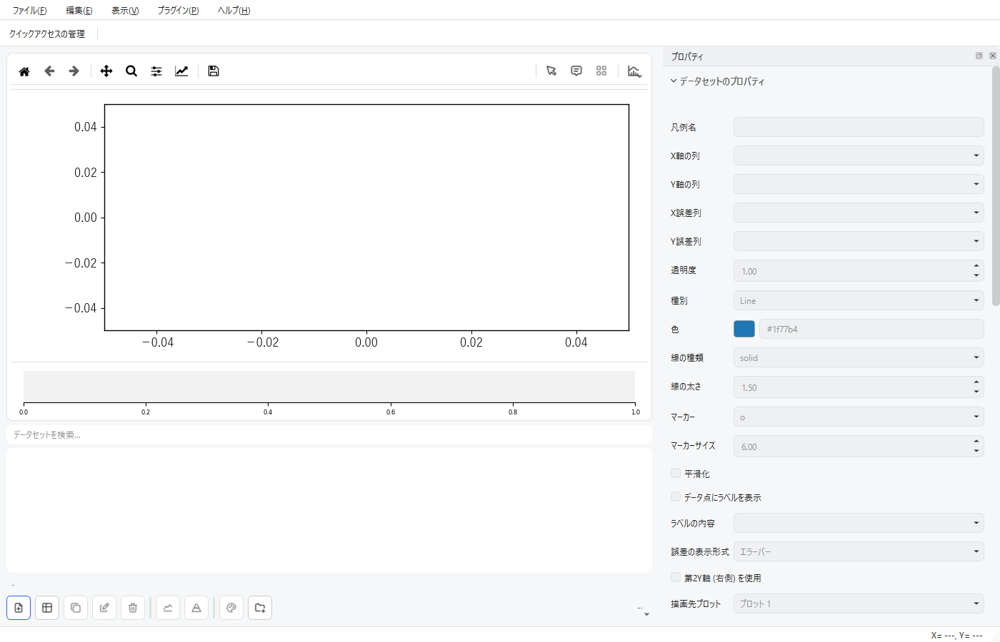 | 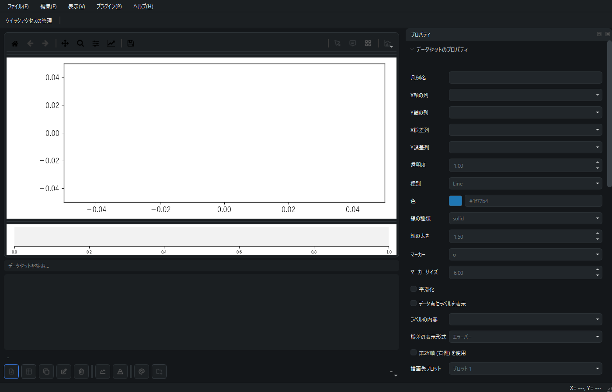 |

**After: ボタンpressed色(青)**:


**テスト(追加分・3回目)**: `tests/test_theme.py`に、`QScrollArea`・
ビューポート・中身のwidgetの3階層すべてに`background: {bg}`が指定されて
いること、`QPushButton:pressed`の背景が`selection_highlight`を使うことを
確認するQSS文字列テストを追加。それに加えて今回初めて、`tests/test_main_
window.py`に**実際にウィジェットを描画してピクセル色を検証する統合テスト**
(`test_properties_dock_content_actually_renders_bg_token_color`)を追加し、
`tests/test_dialogs.py`に装飾ボタンの`focusPolicy()`が`NoFocus`である
ことの確認と、`QTest.mouseClick()`による**実クリック**で選択範囲が正しく
装飾されることを確認する回帰テスト
(`test_label_edit_dialog_bold_button_survives_a_real_mouse_click`)を追加した。

### H-2-4 追加分(4回目、mathtextダイアログの複数装飾バグ+レイアウト系8件)

実機フィードバックで一度に8件の指摘が届いた。

1. **プレビュー欄の文字サイズが枠からはみ出す**: 長いmathtext文字列
   (例: `$\mathbf{wavelength}$ analysis result long title`)がタイトル/
   軸ラベルのプレビュー欄からはみ出していた。事前にレンダリング時の
   フォントサイズを縮小する方式(`render_mathtext_to_pixmap(...,
   max_width_px=...)`)を最初に試したが、呼び出し時点の`widget.width()`が
   QTabWidgetの非アクティブタブ内や初回表示前は実際のレイアウト確定値と
   一致しないため、タブ切り替え直後に文字がはみ出したまま更新されない
   ケースが残った。最終的に**「等倍pixmapを保持しておき、ウィジェット
   自身の`resizeEvent()`で実際の幅/高さが確定するたびQPixmap.scaled()で
   都度フィットし直す」**`FitWidthPixmapLabel`(`gui/mathtext_preview.py`
   新設)に置き換えて解消。タイトル/軸ラベル欄の`_ClickableMathPreviewLabel`
   (`gui/main_window.py`)とダイアログ内プレビュー(後述)の両方がこれを
   継承している。
   - **続報バグ**: 「入力したあとの文字は治ったけど入力する前の
     『～を入力』はまだボックスにおさまってない」。`_apply_fitted_pixmap()`
     が幅の超過だけを見て縮小するかどうか判定しており、高さの超過を
     見ていなかったため、プレースホルダのような幅は十分収まるが天地
     (高さ31px)がラベルの高さ(18px)を超える短いテキストは、一度も
     幅方向の縮小条件に引っかからず縦にはみ出したまま残っていた
     (実際に入力するテキストはmathtext記法込みで横幅が長くなりやすく、
     その際は幅方向の縮小のついでに高さも比例して縮んでいたため、
     このケースだけ気づかれずに残っていた)。幅・高さ両方の超過を見て、
     `QPixmap.scaled(..., Qt.AspectRatioMode.KeepAspectRatio, ...)`で
     縮小するよう修正して解消。
2. **mathtextを複数適用するとバグる(例: イタリック+ボールド、上付き+
   ボールド)**: `LabelEditDialog._apply_wrap()`は装飾操作のたびに結果全体を
   自動選択する(次の操作に備えるため)。ところが、選択文字列が既に
   `$\mathbf{wavelength}$`のような「前後を$で囲まれた1個のmathtext断片」に
   なっていることに気づかず、単純にその断片ごと新しい`$...$`でさらに包んで
   いたため、`$\mathit{$\mathbf{wavelength}$}$`のように**$が入れ子になった
   不正なmathtext構文**になっていた。選択文字列が既に$で囲まれた単一の
   断片であれば中身(内側の$無し部分)だけを取り出してから改めて$で
   囲み直すよう修正。
   - さらに、太字(`\mathbf`)とイタリック(`\mathit`)は共にmatplotlib
     mathtextの「フォントクラス」指定であり、`$\mathit{\mathbf{x}}$`の
     ように入れ子にしても**内側の指定で上書きされるだけで実際には合成
     されない**ことを実機検証で確認した(`\mathbf{\mathit{x}}$`はイタリック
     のみ、`$\mathit{\mathbf{x}}$`はボールドのみになる)。太字と
     イタリックを組み合わせようとしている場合は、代わりに両方を同時に
     表現できる`\boldsymbol{...}`(matplotlibのmathtextパーサ内部で
     Latin文字/ギリシャ文字に対して"bfit"という太字+イタリック合成フォント
     クラスを直接割り当てる特殊コマンド)に置き換えるようにした。
3. **実際にボールド/イタリックが適用されたテキストが見たい**: `text_edit`
   はプレーンな`QLineEdit`のため部分的なリッチテキスト表示はできない
   (生のmathtext構文のままにせざるを得ない)。代わりに、ダイアログ内に
   `text_edit`の実描画結果を表示する`preview_label`
   (`FitWidthPixmapLabel`)を新設し、装飾を適用するたびに実際の見た目
   (太字/イタリック/上付き/下付き/記号すべて反映済み)を確認できるように
   した。
4. **プロパティウィンドウの右側が見切れる**: 3度目の背景色不一致の指摘
   だったが、実際には既存の`{bg}`指定は効いており、真因は別にあった。
   プレビューラベルのpixmapがウィジェット自身の幅より大きいままだと、
   `QLabel`の`sizeHint()`がそのpixmapサイズをそのまま報告し、
   `formLayout_3`のフィールド列がそのぶん押し広げられて`CONTROL_DOCK_WIDTH`
   の想定幅を超えてしまう(結果としてドックの右側が見切れる)ことが
   判明。項目1の`FitWidthPixmapLabel`導入(pixmapを常にウィジェット幅に
   収める)により、この見切れも副次的に解消された(長いタイトル文字列を
   全フィールドに同時投入するストレステストで、水平スクロールバーが
   一切出ないことを確認済み)。
5. **タブの上に灰色の横線が残っている**(「プロパティ」「エクスポート
   プレビュー」タブ化ドック): `QTabBar::tab`/`QTabWidget::pane`のQSSでは
   制御できない別のプリミティブ(タブバーを内容ペインに接続する「土台」線、
   `PE_FrameTabBarBase`、Fusionスタイルが独自に描画する)が原因と判明。
   `QTabBar::close-button`やチェックボックスの描画と同じ理由(QSSで
   スタイルできないサブコントロール)で、`_FlatThemeProxyStyle.
   drawPrimitive()`にこのプリミティブの描画を丸ごと抑制するケースを追加
   して解消。
6. **ドックタイトル下の線も消したい**: 項目5と同じ`PE_FrameTabBarBase`
   プリミティブが原因である可能性が高く、同じ修正で併せて解消したと
   考えられる(スタイル全体に適用されるプロキシスタイルの修正のため)。
7. **プロットパネルの枠線を消す**: `QWidget#plot_container`の`border`
   プロパティを削除(`background`/`border-radius`によるカード風の背景・
   角丸は維持)。
8. **ミニマップの灰色の色味を他の背景と揃える(ただし同じ色にはしない、
   少し暗く)**: 以前の`#f2f2f2`(ライト)/`#1e1e1e`(ダーク)は無彩色
   (R=G=B)のフラットグレーで、`gui/theme.py`のトークン(寒色寄り、
   R<G<Bの傾向)と色味が揃っていなかった。同じ色相を保ちつつ、周囲の
   パネル背景そのもの(`surface_2`/`bg`)より一段暗いトーン
   (`#E3E6EB`/`#0E1114`)に変更し、「一段窪んだ独立領域」であることが
   分かるようにした。

**Before/After**(プレースホルダの縦方向フィット):

| ライト | ダーク |
|---|---|
| 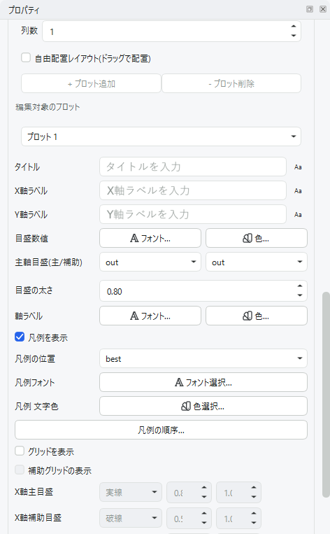 | 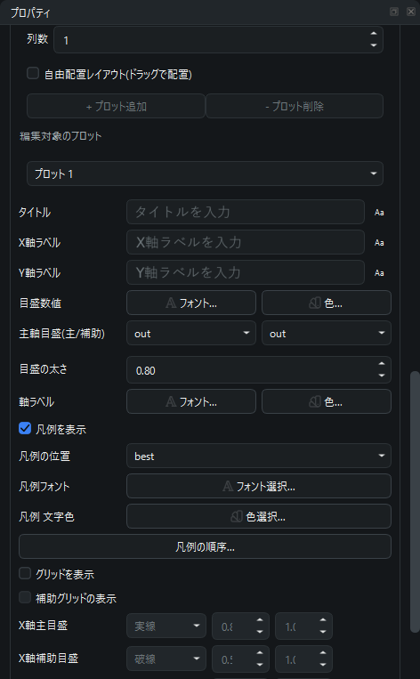 |

**After: 太字+イタリックの組み合わせ(\boldsymbol)+ダイアログ内プレビュー**:

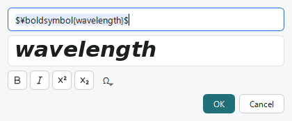

**Before/After**(タブ上部の灰色の線):

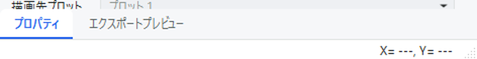

**Before/After**(プロットパネルの枠線):

| ライト | ダーク |
|---|---|
| 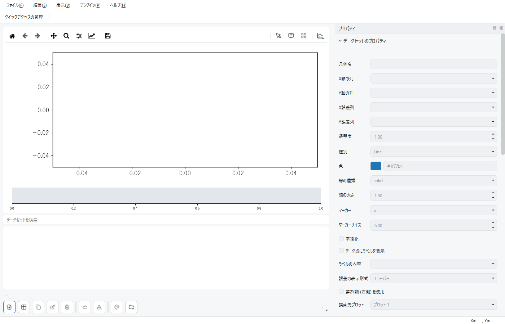 | 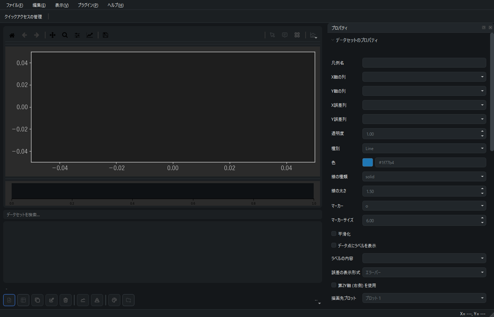 |

**テスト(追加分・4回目)**: `tests/test_mathtext_preview.py`に
`FitWidthPixmapLabel`が既に収まる場合はそのまま・幅超過時は縮小・
**高さのみ超過**の場合も縮小・`resizeEvent()`での再フィット追従・
`_natural_pixmap`未設定時にクラッシュしないことを確認するテストを追加。
`tests/test_dialogs.py`に太字→イタリック/イタリック→太字それぞれの
`\boldsymbol`合成、上付き+太字の二重$なし合成、通常の単発装飾、ダイアログ内
プレビューの初期表示・textChanged追従を確認するテストを追加。
`tests/test_theme.py`に`QWidget#plot_container`の`border`が無いこと、
`_FlatThemeProxyStyle`が`PE_FrameTabBarBase`の描画を基底スタイルへ
委譲しない(抑制する)ことを確認するテストを追加。`tests/test_minimap_widget.py`
に軸背景色が無彩色グレーではなく寒色寄りの色相を持つこと、既存の
`surface_2`/`bg`トークンより暗いことを確認するテストを追加。

## H-2-5. クイックアクセスツールバー(#87)

`gui/mixins/quick_access_mixin.py`の`_create_quick_access_toolbar()`を
確認した。H-0調査時点の所見通り、独自のインラインスタイルは一切無く
`QToolBar`+既存メニューの`QAction`をそのまま再利用するだけの実装で、
移動グリップの無効化(`setMovable(False)`)もH-2-1で既に対応済みだった。

実際にボタンを押下状態・チェック状態にして確認したところ、**1件のバグを
発見した**: `QPushButton`側は`:hover`/`:pressed`とも既にH-2-4追加分で
`selection_accent`/`selection_highlight`(青系)へ統一済みだったが、
**`QToolButton`側は同じ更新が漏れており、`:pressed`/`:checked`が依然
ティール系`accent_soft`のままだった**。ツールバー上のボタン(クイック
アクセスにピン留めしたボタンも、カーソルツール/注釈ツール等の既存トグルも
含む)は全て`QToolButton`のため、クイックアクセスにピン留めしたボタンを
押すと緑っぽい色になる、カーソルツールを選択した状態の枠線が緑になる、
という状態だった。`QPushButton:pressed`と同じ`selection_highlight`
(半透明の青)を背景に、`:checked`は`selection_accent`(不透明の青)を
枠線に使うよう統一した。

**Before/After**(クイックアクセスツールバー全体、ライト/ダーク):

| ライト | ダーク |
|---|---|
| 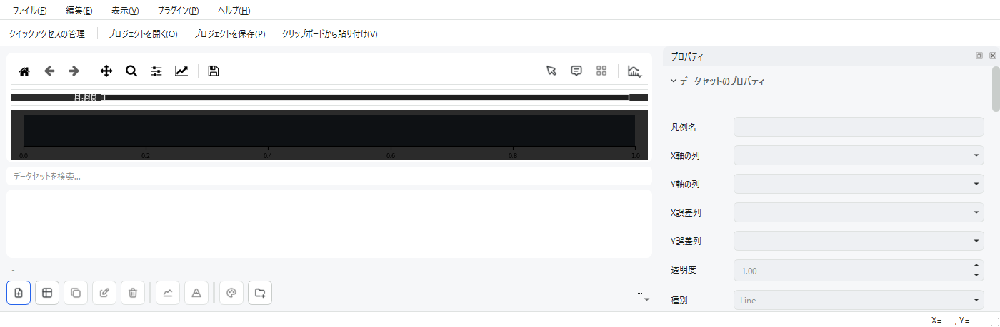 | 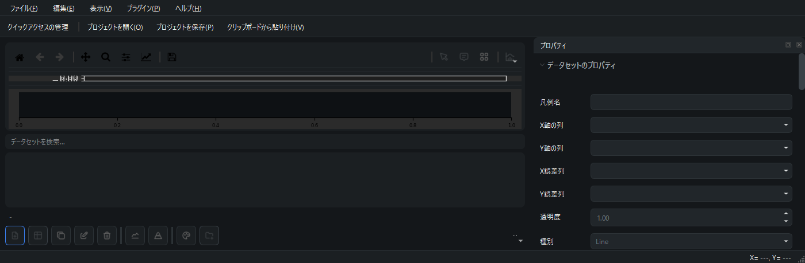 |

**Before/After**(ボタンのpressed/checked色、青に統一):

| pressed | checked |
|---|---|
|  |  |

**テスト**: `tests/test_theme.py`に、`QToolButton:pressed`の背景が
`selection_highlight`、`QToolButton:checked`の背景/枠線が
`selection_highlight`/`selection_accent`を使うことを確認するテストを
追加。既存の`tests/test_quick_access_mixin.py`(ピン留め/解除・永続化・
コンテキストメニュー等の機能テスト、全11件)は無関係のため変更なし、
全件グリーンのまま。

## H-2-6. ダイアログ群(環境設定/エクスポート設定/フィット等)

`gui/dialogs.py`配下の25個の`QDialog`サブクラス全てを、ライト/ダーク両モードで
実際にレンダリングして目視確認した(バックグラウンドAgent2体を並行展開し、
13件・12件に分けて監査)。**大半(22/25)は既にH-2-1〜H-2-4のグローバルQSSを
自動的に継承しており、追加の個別対応は不要**という結果だった(ボタンの
hover/pressed/focus、チェックボックス、リストの選択ハイライト等が
いずれも既存の`selection_accent`/`selection_highlight`規約通り)。
実際に問題が見つかったのは3件で、いずれも**「QSSではなく個別ウィジェットの
実装に起因するバグ」**という共通点があった。

1. **`ColorPaletteDialog`(配色パレット管理ダイアログ)の色見本が読めない
   (最重要)**: `_refresh_color_list()`が`QListWidgetItem.setBackground()`/
   `setForeground()`で行全体をパレット色に塗り、明るさに応じて文字色を
   白/黒に自動選択していた。ところが`gui/theme.py`の
   `QTreeWidget::item, QListWidget::item, QTableWidget::item { padding:
   3px; }`規則が、パディングの指定だけであっても`::item`サブコントロールを
   「QSSでカスタム描画されるもの」とみなしてしまい、Qtは
   `BackgroundRole`/`ForegroundRole`(=`setBackground`/`setForeground`が
   書き込む先)を描画時に無視するようになる。これは本コードベースで
   既に複数回踏んでいる既知のQt/QSSの癖(`QTabBar::close-button`の
   アイコン消失、チェックボックスのチェックマーク消失と同根)で、
   実機では常にリストの地の色(`surface`トークン)がそのまま描画され、
   文字色だけが(見えない背景を前提に選ばれた)白または黒になっていた
   結果、ライトモードでは明るい色(青・緑)が白地に白文字で、ダークモードでは
   逆に暗い色が暗い地に暗い文字で、それぞれ消えて見えなくなっていた。
   対策として、行の描画をQSSに委ねず`setItemWidget()`で小さな正方形の
   スウォッチ(`ColorPickerWidget`と同じ意匠、枠線は`border_strong`
   トークン)+通常のテーマ文字色のテキストラベルという専用ウィジェットに
   置き換えた。テキストが常にテーマの通常文字色で描画されるため、
   スウォッチがどんな明るさでも可読性の問題が起きなくなった。
2. **`HelpDialog`/`CalcHelpDialog`の表見出し行がダークモードで見えない**:
   mathtextリファレンス・列計算リファレンスの各表(計9箇所)が、見出し行に
   `style="background-color: #f0f0f0;"`という固定の薄いグレーをHTML内に
   直接ハードコードしていた。ライトモードでは問題なかったが、ダーク
   モードでは薄グレーの塊がほぼ見えないまま浮き、見出し文字も判読できない
   状態だった。HTML内の該当箇所を`class="header-row"`に置き換え、実際の
   色は`QTextDocument.setDefaultStyleSheet()`経由で現在のテーマトークン
   (`surface_2`/`text_primary`)から注入するようにした(ダイアログは
   都度新規に構築されるため、テーマ切替の都度再生成する仕組みは不要)。
3. **`ColorPickerWidget`のスウォッチ枠線が固定色(H-0で既知)**: データセット
   プロパティの色選択欄が`rgba(128, 128, 128, 110)`という`gui/theme.py`の
   トークンと無関係な固定グレー枠線を使っていた。`border_strong`トークンを
   参照するよう変更し、ダークモード切替時に再描画する`refresh_theme()`を
   新設(`_on_toggle_dark_mode`から呼ぶ)。

**Before/After**(ColorPaletteDialog、色が全て読めるようになった):

| ライト(カスタムパレット) | ダーク(カスタムパレット) |
|---|---|
| 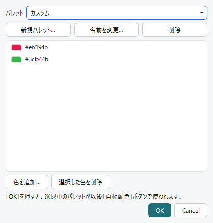 | 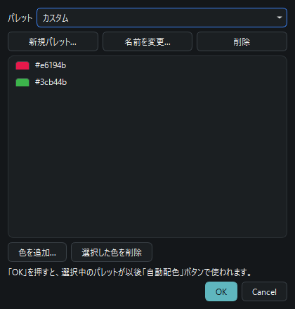 |

Matplotlib既定パレット(青・オレンジ・緑、以前は白文字選択の青・緑が
ライトモードで見えなかった組み合わせ):

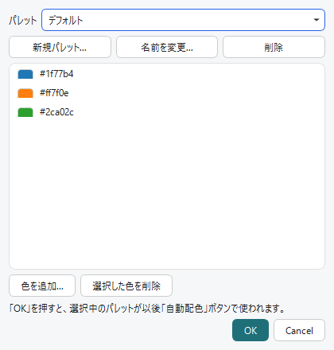

**Before/After**(HelpDialog、表見出し行):

| ライト | ダーク |
|---|---|
| 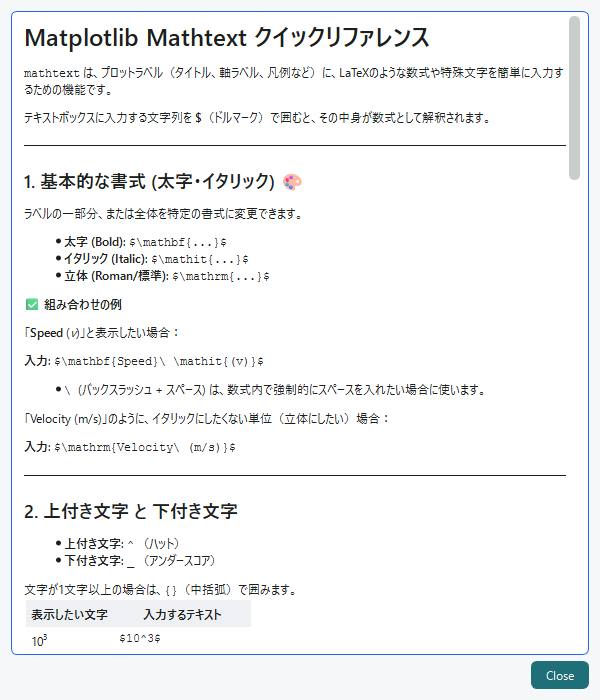 | 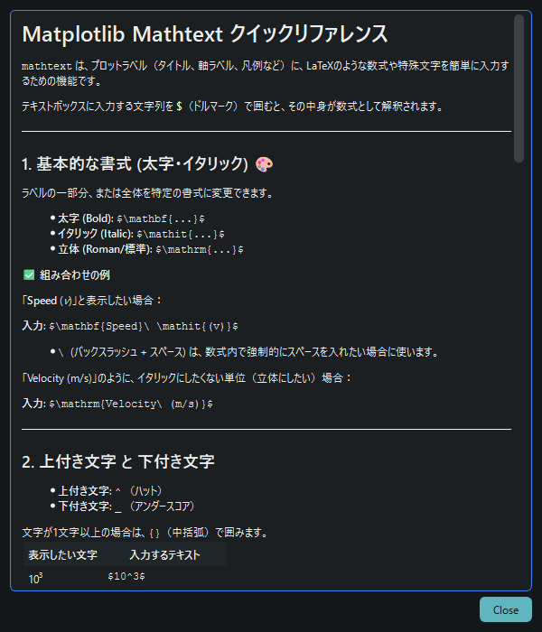 |

**After**(CalcHelpDialog、ダークモード、2つの表とも見出しが読める):

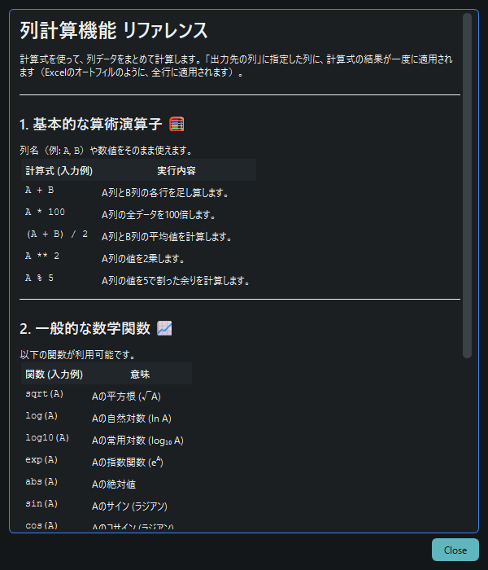

**Before/After**(ColorPickerWidgetのスウォッチ枠線):

| ライト | ダーク |
|---|---|
|  |  |

**テスト**: `tests/test_dialogs.py`に`ColorPaletteDialog`の行数・
スウォッチ/テキストラベルの分離・`setBackground`/`setForeground`ロールに
戻っていないことの確認・行選択(`currentRow()`)による色削除が引き続き
機能すること・Matplotlib既定パレットの件数一致、`HelpDialog`/
`CalcHelpDialog`の`#f0f0f0`ハードコード不在・`setDefaultStyleSheet()`が
現在のテーマトークンを含むことを確認するテストを追加。
`tests/test_color_picker_widget.py`に`border_strong`トークン使用・
`refresh_theme()`によるダークモード追従を確認するテストを追加。
`tests/test_main_window.py`に`_on_toggle_dark_mode`が両方の
`ColorPickerWidget`インスタンスの`refresh_theme()`を呼ぶことを確認する
テストを追加。

### H-2-6 追加分(実機フィードバック: ポップアップの既定ボタン+グループ見出しチップの色)

H-2-6完了後、複数のダイアログ(バッチエクスポート・環境設定・
サンプルプラグインのメッセージボックス・ヘルプ・フォント選択・色選択)の
スクリーンショット提示を受け、2件追加で対応した。

1. **ダイアログの既定ボタン(実行/OK/Close)の色が緑のまま**: フォーカス/
   選択/チェック状態・ボタンのhover/pressedは既に全てselection_accent
   (青)に統一済みだったが、`QPushButton:default`(`QDialogButtonBox`が
   Enterキー実行用に自動的にdefaultにするボタン)だけはブランドアクセント
   (ティール系`accent`)のまま意図的に残していた。複数のダイアログを横断
   して見ると、この1箇所だけ色相が違うことがかえって「まだ緑が残っている」
   という印象を与えていたため、背景/枠線を`selection_accent`に統一した
   (文字色は`accent_text`のまま、チェックボックスのチェック時塗りつぶしと
   同じ組み合わせを踏襲)。
2. **環境設定/フォント選択ダイアログのグループ見出しチップ(「外観」
   「言語」「保存」やQFontDialogの「Effects」「Sample」)が緑+見切れて
   いる**: 色は上記と同じ理由でselection_accent/selection_highlightに
   統一。見切れ(クリッピング)は別原因で、`QGroupBox::title`が
   `top: -6px`(グループボックス自身の外枠より6px上に突き出す配置)を
   使っており、これは`QGroupBox`側の`margin-top: 20px`で確保した外側の
   余白にチップが浮き出る前提の実装だった。自前で構築するダイアログ
   (`PreferencesDialog`等)ではこの余白が正しく効いていて問題なかったが、
   `QFontDialog`/`QColorDialog`のようなQt標準ダイアログ(内部レイアウトを
   直接制御できない)では、この上方向の突き出し分の外側の余白が確保されず、
   チップの上端(丸みを帯びた部分)が周囲の要素に隠れて見切れていた
   (拡大スクリーンショットで、チップ上端の角丸が欠けていることを確認)。
   `top: 0px`に変更し、グループボックスの外枠の外へ一切はみ出さない
   (=周囲のレイアウト側の余白に依存しない、どんなダイアログでも安全な)
   配置にして解消した。

**Before/After**(バッチエクスポートの「実行」ボタン):

| ライト | ダーク |
|---|---|
| 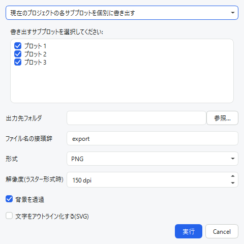 | 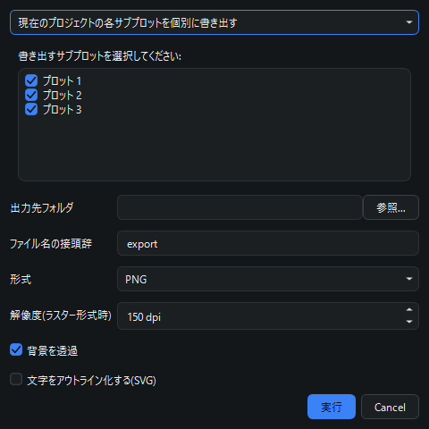 |

**Before/After**(グループ見出しチップの色+クリッピング、QFontDialogの
「Effects」チップを拡大):

| Before(緑+上端が見切れている) | After(青+完全な角丸) |
|---|---|
| 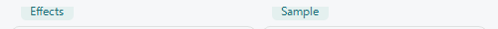 | 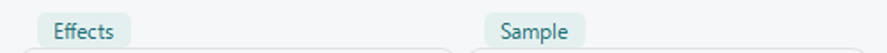 |

**Before/After**(環境設定ダイアログ全体):

| ライト | ダーク |
|---|---|
| 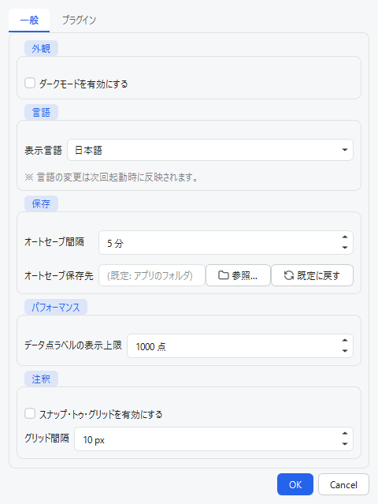 | 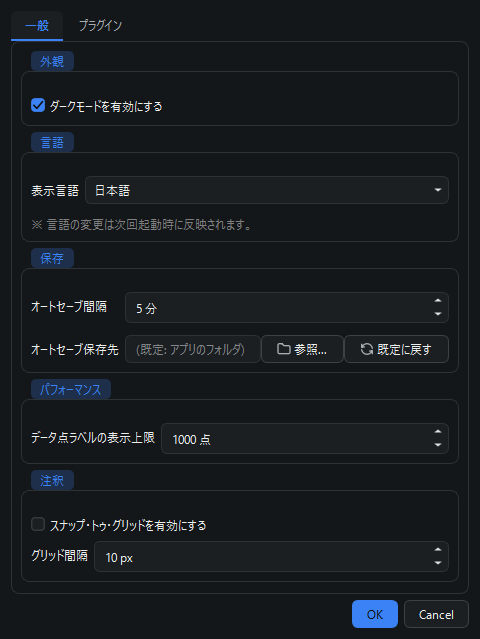 |

**After**(メッセージボックス・色選択ダイアログのOKボタン):

| メッセージボックス | 色選択 |
|---|---|
| 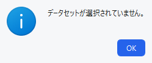 | 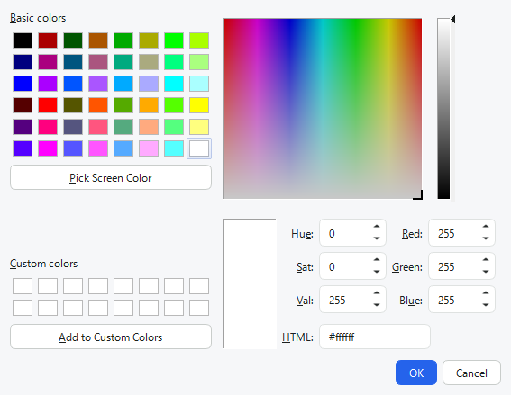 |

**テスト**: `tests/test_theme.py`に、`QPushButton:default`の背景/枠線が
`selection_accent`を使いティール系`accent`を使っていないこと、
`QGroupBox::title`の文字色/背景が`selection_accent`/`selection_highlight`
を使うこと、`top`オフセットが負の値でない(グループボックスの外枠の外に
はみ出さない)ことを確認するテストを追加。テスト実装中、自分自身が書いた
説明コメント文中に旧仕様の値(`"top: -6px"`)を文章として含めていたため、
正規表現が実際のCSSプロパティではなくコメントの地の文を誤ってマッチして
しまう不具合を踏んだ(コメントを除去してから検証するよう修正)。

## H-2-7. プラグイン管理UI(F-2)へのスタイル適用

`PreferencesDialog`の「プラグイン」タブを、実際のプラグイン一覧
(有効/無効化中/エラーの3状態混在)を使って目視確認した。**H-2-6の
ダイアログ全体スタイリングが既に自動的に反映されており、追加のQSS対応は
不要**と判断した: タブの選択下線・読み込み済みプラグインリストの
チェックボックス(青の塗りつぶし角丸四角)・グループ見出しのアクセント
チップ・フック単位のエラー一覧、いずれもH-2-2〜H-2-4で確立した規約
(青=`selection_accent`、チップ見出し等)通りに描画されていることを
スクリーンショットで確認した。

**任意の改善案(未実施)**: 無効化中/エラーのプラグイン行は現状テキストの
文言(「(無効化中)」「— エラー: ...」)だけで区別しており、色やアイコンでの
視覚的な区別は無い。将来的に一覧が長くなった場合のスキャン性向上として
検討の余地はあるが、今回のスコープ(既存スタイルの適用確認)を超えるため
見送った。

**Before/After**: 「プラグイン」タブ(有効1件・無効化中1件・エラー1件・
フック登録エラー1件を含む):

| ライト | ダーク |
|---|---|
| 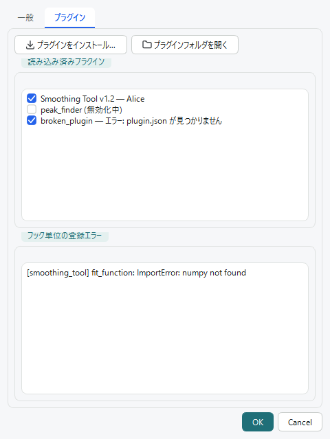 | 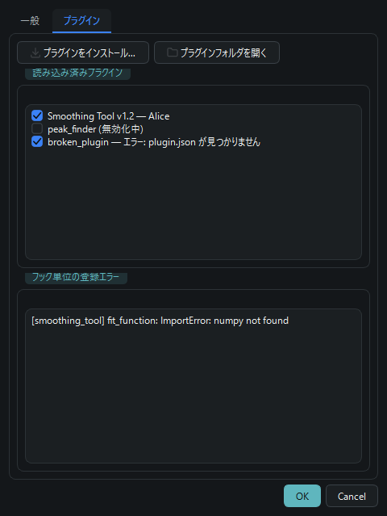 |

## H-2-8. ステータスバー・通知トースト類

対象は`QMainWindow`下部の`QStatusBar`(座標表示ラベル`self.coordinate_label`
+ 各所からの`self.statusBar().showMessage(...)`による一時メッセージ)。
このアプリに専用の「トースト」ウィジェットは存在せず、Qt標準のステータス
バー一時メッセージ機構がその役割を担っている。

実際に一時メッセージと座標ラベルを同時に表示させてライト/ダーク両モードで
確認したところ、`gui/theme.py`の既存`QStatusBar`規則(背景・上部境界線)を
問題なく継承しており、ハードコードされた色や既定Qtスタイルの sunken枠のような
不整合は見つからなかった。**追加のスタイル対応は不要と判断した**
(H-2-7と同じく、既存のグローバルスタイリングが正しく機能しているケース)。

**Before/After**(一時メッセージ+座標ラベル表示中):

| ライト | ダーク |
|---|---|
| 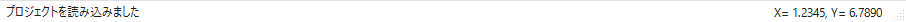 | 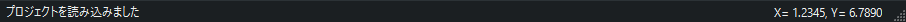 |

## H-3. matplotlib(Figure)側の配色連動

`gui/canvas.py`は以前、`DARK_FIGURE_FACECOLOR = '#2b2b2b'`のような個別の
ハードコード値を持ち、`gui/theme.py`のデザイントークンとは完全に無関係
だった(H-0調査で判明していた既知の不整合、3節参照)。値が近いだけで一致は
しておらず、Qtの寒色寄りグレー(R<G<Bの傾向)とmatplotlib側の無彩色グレー
(R=G=B)がわずかに食い違っていた。`gui/theme.py`の`LIGHT_TOKENS`/
`DARK_TOKENS`を直接参照するよう変更し、今後トークン側を変更すればグラフ
側にも自動的に反映されるようにした。

- **Figure(外側の余白)/Axes(データが描かれる領域)**: 両方とも`surface`
  トークンに統一。`plot_container`(`gui/main_window.py`)がキャンバス周囲に
  6pxのQtレベルの余白を持ち、その背景色も`{surface}`そのものであるため、
  FigureとAxesを同じ`surface`に揃えることで、Qt側の余白とmatplotlib側の
  余白の間に色の継ぎ目ができないようにしている(実機で6px余白を含む
  キャプチャを撮り、継ぎ目が無いことを確認済み)。ライトモードは元々
  両方`#ffffff`で一致していたため、この設計を踏襲した形。
- **テキスト色(タイトル/軸ラベル/目盛/パネルラベル)**: `text_primary`
  トークンに統一。
- **凡例**: 面色を`surface_2`、枠線を`border_strong`トークンに変更。
  以前はライトモードで凡例の面色が軸背景と同じ`#ffffff`のままで、枠線
  だけで辛うじて視認できる状態だった(`frame.set_alpha(0.92)`の半透明も
  同色背景の上ではほぼ効果が無かった)。`surface_2`により、軸背景と
  明確に区別できる「一段乗ったチップ」の見た目になった(実機確認)。
- **グリッド線**: 以前は色を指定しておらず、matplotlibの既定値
  (rcParams、テーマと無関係な固定の薄灰色)に任せきりだった。
  `border_strong`トークンを明示的に指定し、背景色との調和を取った。

なお、ロードマップ文書に記載されていた「データセットごとに背景色を個別
設定できる場合の優先順位」という要確認事項は、実装を確認した結果
該当しないことが分かった(`ax.set_facecolor()`は常にテーマ駆動で、
ユーザーがAxes背景色を個別上書きできる設定項目は現状存在しない)。

**Before/After**(凡例・グリッド線・パネルラベルを含む実際のプロット):

| ライト | ダーク |
|---|---|
| 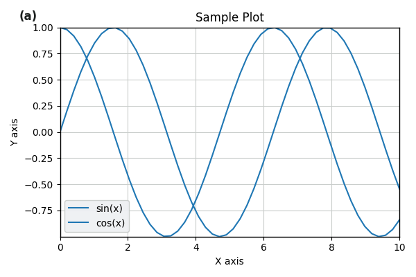 | 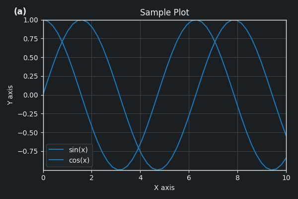 |

**継ぎ目が無いことの確認**(plot_containerの6pxのQt余白 vs Figureの背景色):

| ライト | ダーク |
|---|---|
| 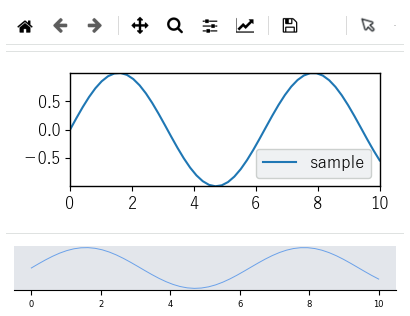 | 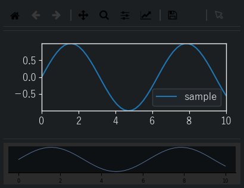 |

## H-4. アイコンセットの見直し

**判断**: Tabler Icons SVGセット自体の刷新は見送り(既存アイコンで
十分にモダンな見た目が保たれており、追加の依存を増やす理由が無い)。

一方、H-0調査で「未検証」として記録されていた懸念(`gui/icon_utils.py`
の`DEFAULT_ICON_COLOR = '#3B3F42'`という固定のダークグレーがダークモードで
どう見えるか)を実機で確認したところ、**深刻な視認性バグを発見した**:

1. **`gui/main_window.py`のメインツールバー(home/back/forward/pan/zoom/
   subplot-config/save)のアイコンが、ダークモードでほぼ見えなくなって
   いた**。原因は2つ複合していた:
   - matplotlib純正の`NavigationToolbar2QT._icon()`はアイコン読み込み時に
     `QPalette`の背景明度を見て自動的にダークモード配色へ切り替える仕組みを
     内蔵しているが、これはツールバー構築時(=常にライトモードのパレットで
     初期化されるアプリ起動時)に一度だけ実行され、以後ダークモードに
     切り替えてもアイコンは再読み込みされない。
   - カーソル/注釈/レイアウト編集ツールのような自前のTabler Iconsアイコンは、
     固定色`TOOLBAR_ICON_COLOR = '#3B3F42'`(暗いグレー)を使っており、
     ダークモードのボタン背景に対してほぼ同化していた。
2. **ダイアログ内のアイコン(フォルダ参照/更新/ダウンロード/装飾ボタン等)も
   同じ理由でダークモードで視認性が低かった**(`gui/icon_utils.py`の
   `icon()`のデフォルト色が同じ固定値だったため)。

**対応**:
- `gui/icon_utils.py`の`icon()`・`gui/main_window.py`の`_svg_icon()`: 色を
  省略した場合、呼び出しの都度`gui.theme.current_tokens()`の
  `text_secondary`トークンから動的に解決するよう変更(固定のデフォルト
  引数値ではなく、関数本体で都度解決する形に変更)。
- ダイアログ内のアイコン(H-2-6の対象、都度新規構築される)はこれだけで
  解決する。
- 永続的なウィジェット(メインツールバーのボタン、データセット操作
  ボタン群、フォント/色選択ボタン群、統計/パレット系メニュー、折りたたみ
  セクションのシェブロン)は構築時に一度だけ`setIcon()`されるため、
  `_on_toggle_dark_mode`から明示的に再読み込みする
  `_refresh_custom_svg_icons()`(`gui/mixins/ui_setup_mixin.py`)を新設。
- matplotlib純正のナビゲーションツールバーは、非公開の`toolitems`/
  `_actions`属性を使って各アクションのアイコンを手動で再読み込みする
  `_refresh_mpl_toolbar_icons()`を新設(将来のmatplotlibバージョンで
  構造が変わる可能性を考慮し、属性が存在しない場合は何もしない安全側の
  実装にしている)。

**Before/After**(メインツールバー、ダークモード):

| Before(見えない) | After(視認可能) |
|---|---|
| 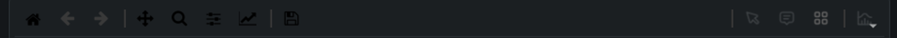 | 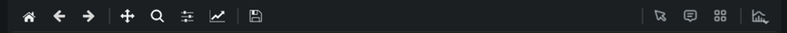 |

**Before**(プラグインタブのダイアログ内アイコン、ダークモード):

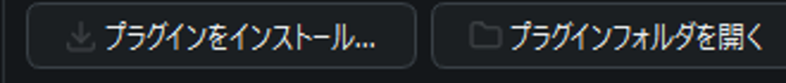

**After**(データセット操作ボタン群、ダークモード):

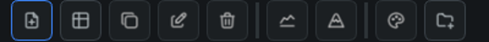

**テスト**: `tests/test_icon_utils.py`に`icon()`が色省略時に現在のテーマの
`text_secondary`トークンを使うこと(ライト/ダーク双方)、明示的な色指定は
テーマより優先されることを確認するテストを追加。`tests/test_canvas.py`に
Figure/Axes/凡例/グリッド線の各色定数がテーマトークンと一致すること、
`dark_mode`フラグに応じてAxes背景・グリッド線色が実際に切り替わることを
確認するテストを追加。`tests/test_main_window.py`に、`_on_toggle_dark_mode`
が`_refresh_mpl_toolbar_icons`/`_refresh_custom_svg_icons`の両方を呼ぶこと、
`mpl_toolbar`属性が`NavigationToolbar2QT`のインスタンスであること、
実際にダークモード切替でアイコンのピクセル内容が変化すること(matplotlib
純正アイコン・自前SVGアイコン・折りたたみシェブロンそれぞれ)を確認する
テストを追加。テスト実装中、グローバルなテーマ状態(`gui.theme.
_current_tokens`)がテスト実行順序によって前のテストの影響を受ける
既知のクラスの不具合を新たに踏んだため(前のテストがダークモードのままに
していると、次のテストの「ライトから開始する」前提が崩れる)、各テストで
明示的に`theme.apply_theme(qapp, dark=False)`してから検証を開始するよう
修正した。


---

## H-5. 画像回帰テストの追加

**やること**: H-2のコンポーネント単位の変更が今後の開発で意図せず崩れない
よう、代表的な画面（メインウィンドウ・環境設定ダイアログ・エクスポート
プレビュー）のスクリーンショット比較テストを追加する。

`pytest-mpl`は新規依存を増やすため採用せず、ロードマップの「pytest-mplまた
は類似の仕組み」という表現の範囲内で、これまでのH-2各フェーズで使ってきた
「`QWidget.grab()` → `QPixmap`」パターンをそのまま流用した自前の仕組みに
した。`tests/test_gui_style_regression.py`を新設し、`tests/baseline_images/`
配下にライト/ダーク各3画面、計6枚のベースラインPNGを記録する。

比較は`numpy`でQImageのピクセル配列に変換し、1ピクセルあたりのチャンネル差
（アンチエイリアシング等の微小な揺れを無視するための許容値、24/255）を
超える差分ピクセルの比率が、全体の2%を超えたら回帰とみなす閾値ベースの
判定にしている（ロードマップの「CIで差分が閾値を超えたら警告」という
考え方に合わせた、完全一致ではなくソフトな検出）。ベースラインPNGが
存在しない場合は、その場で新規保存してテストをスキップする（2回目の
実行から実際の比較が行われる）。

**画像回帰テスト自身がpytest経由（offscreenプラットフォーム）で実行される
ため、docs/screenshots/配下の実機確認用スクリーンショット（CJKフォント
込みで見た目を人が確認するためのもの）とは別物である点に注意**:
`tests/conftest.py`が`QT_QPA_PLATFORM=offscreen`を強制するオフスクリーン
環境では、日本語フォントが正しく解決されず豆腐（tofu）ボックスとして
描画される（このセッションのH-2各フェーズで実機確認用に撮った
`docs/screenshots/`配下のPNGは、あえて`QT_QPA_PLATFORM`を設定しない
スクリプトから撮ることで実際のCJKフォント描画を得ていた、という違いが
ある）。この画像回帰テストの目的は色・レイアウト・余白等のスタイル
トークンの回帰検出であり、テキストの可読性そのものはこのテストの対象外
（＝豆腐ボックスのままで機能上問題ない）。

**完了条件**: `tests/test_gui_style_regression.py`が追加され、H-2完了時点
（H-2-5〜H-2-8・H-3・H-4・および実機フィードバックによる各追加修正すべてを
含む）の見た目がベースラインとして記録されている。**達成（2026-08-09）**。

**テスト**: 6件（メインウィンドウ/環境設定ダイアログ/エクスポート
プレビューパネル × ライト/ダーク）。同一環境での再実行によりベースライン
との差分0%（完全一致）を確認済み、`test_theme.py`/`test_dialogs.py`との
混在実行でも実行順序による干渉が無いことを確認済み。
